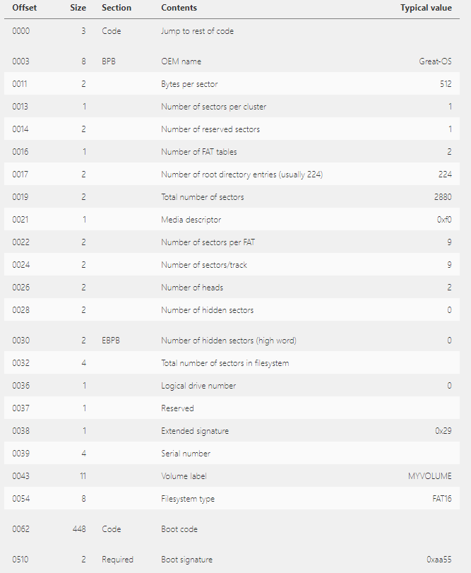
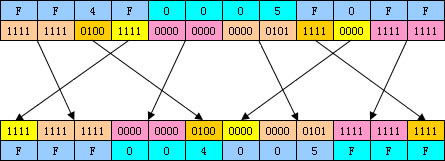

## OS笔记

这个笔记主要侧重于记录我尝试根据各种资料学习写一个极简的OS的过程。

首先列出环境与主要参考书目

之后会拷贝原来写的很凌乱的一些早期的笔记，然后才会继续正题。

要注意的是，这一部分肯定会和汇编语言有很多的联系，所以有些内容可能需要结合汇编语言笔记。那里面写过的东西这里就不会再赘述。


### 环境与参考书目

主要的参考书目是[一个64位操作系统的设计与实现](https://book.douban.com/subject/30222325/)，第二本参考书是[x86汇编语言:从实模式到保护模式](https://book.douban.com/subject/20492528/)。


然后书中建议的是，使用Linux平台，然后需要使用nasm进行汇编的编译，语法的话实际上是Intel语法和AT&T语法的结合，至于原因书中有详细解释，我觉得这样其实很好，从多学一些东西的角度来说。然后c语言的编译器来自于GNU的gcc。另外还有早期的模拟运行环境，明显在早期的时候，需要很多调试，所以直接使用U盘和物理平台结合的测试方法并不合适，于是需要一个虚拟机，这里使用的是Bochs，据说用它的原因是它是一个带了调试功能的虚拟机，这就是和普通虚拟机软件不一样的地方。

为什么会利用Linux作为开发平台呢？其实我并没有找到特别的理由，可能就是Linux上面工具链比较完善。但是实际上我现在使用的是windows平台，主要原因是我不习惯于日常使用Linux，虽然我装了双系统，我也不想通过虚拟机在windows上使用Linux，然后，现在我也得到了一个Linux系统的服务器，但是我在bochs的安装上遇到了问题，安装失败了。

总而言之，现在我的工作环境是：

windows，需要安装nasm，然后安装bochs，然后将nasm编译的bin文件写入img的时候，在Linux上面会使用dd命令，在windows上面为了方便就会安装cygwin这个软件，这个软件可以让我们使用linux的一些命令，其中就包含了dd。

bochs需要一个配置文件，这里我从网上搞到了一个极简版的配置文件：

~~~
megs:32

romimage:file=$BXSHARE/BIOS-bochs-latest
vgaromimage:file=$BXSHARE/VGABIOS-lgpl-latest

floppya:1_44=a.img,status=inserted

boot:floppy

log:bochsout.txt

mouse:enabled=0

keyboard: keymap=$BXSHARE/keymaps/x11-pc-de.map
~~~

保存为`stan.bxrc`文件即可。

然后要使用bochs生成一个img光盘文件。过程在书中有细致描述，不再赘述了。

然后通过cygwin.bat打开cygwin的命令行，进入到合适的文件夹下，通过`dd if=boot.bin of=a.img bs=512 count=1 conv=notrunc`来进行写入，当然为了方便起见的路径什么的就自己搞好了。总之这里和书上没什么区别。

#### 启动虚拟机

可以先试用书上提供的第一个boot.asm，得到bin，写入img，搞好bochs的配置文件，然后运行`bochs.exe`，选择load加载配置文件，然后start即可运行，一切顺利的话应该就能看到start boot这样的输出。


ok，如一开始所述，下面会拷贝一些早期的资料收集，仅作为记录，可以直接跳过。

这一部分自`早期记录`至`实模式下的地址分配`之前

### 早期记录

其实网上很多教程写的很好，只是我不懂的看而已。第一部分，我需要知道计算机是如何启动的。

我的参考文献和博客很杂，这里不再一一举出。

只是这一块主要来自于[这篇博客](https://blog.csdn.net/langeldep/article/details/8788119)，下面的内容基本完全来自这篇博客，只是精简了而已。

整个启动过程分为四部分，其中第一部分可以认为是由硬件制造商控制的，属于硬件自动执行的，我们无法接管。其余三部分或多或少都能控制。

这四部分分别是BIOS,MBR,硬盘启动，操作系统

##### BIOS

电脑中有一块ROM，其中刷写着开机程序，第一件事就是执行这里面的程序，这个程序叫BIOS，全称Basic I/O System

BIOS其实包含了很多功能模块，首先他会执行硬件自检(Power-On Self-Test)，检查硬件是否满足开机需要，没有问题的话，BIOS会从启动顺序里面找到开始执行下一阶段启动程序的设备，这就是我们会设置的启动顺序。

依次尝试各设备，直至成功启动

##### 主引导记录(MBR)

启动顺序中的存储设备都有特殊的存储结构，具体而言就是存储设备的第一个扇区512个字节必须是一段主引导记录(Master boot record)，这512个字节有特定的结构，计算机会首先取出这前512字节放入内存指定位置。

由于MBR只有512字节，因而内容有限，主要作用就是告诉计算机去何处寻找操作系统。

MBR的结构：

```
1-446字节：调用操作系统的机器码
447-510字节：分区表
511-512字节：主引导记录签名
```

对于第一顺位的存储设备，计算机先读取其MBR，之后会检查511和512两个字节，只有当这两个字节内容为`0x55 0xAA`的时候才会继续，否则换第二个存储设备

硬盘是可以分区的，每个区都可以安装不同的OS，主引导记录需要知道应该将控制权交给哪个分区。

分区表共64字节，分为四项，各16字节，每一项都代表一个主分区。因此一个硬盘最多只能有四个主分区。

每个项的16个字节都包含6个部分：

```
（1） 第1个字节：如果为0x80，就表示该主分区是激活分区，控制权要转交给这个分区。四个主分区里面只能有一个是	 激活的。
（2） 第2-4个字节：主分区第一个扇区的物理位置（柱面、磁头、扇区号等等）。
（3） 第5个字节：主分区类型。
（4） 第6-8个字节：主分区最后一个扇区的物理位置。
（5） 第9-12字节：该主分区第一个扇区的逻辑地址。
（6） 第13-16字节：主分区的扇区总数。
```

因为扇区的总数只有4字节，所以主分区的扇区不多于2的32次方。

##### 硬盘启动

这个也是分情况的，三种情况，分别是使用了主分区进行启动，逻辑分区或者扩展分区启动，启动管理器启动。这相当于给了一些多样化的启动选项，具体是哪种，就是由MBR的前446字节确定的了。而我提到过的GRUB就是第三种情况。

具体的，看博客原文吧。

##### 操作系统

转交控制权给操作系统之后，就开始载入操作系统了。从内核开始。


##### Boot

DIY的第一步是尝试接管启动过程的第二步，自己写一个MBR，这里也经常被叫做自己完成boot code

MBR的全部512个字节并不是全都重要，如果要写，就必须知道这512字节的详细构造：



这张图片来自于[这个网站](http://www.independent-software.com/operating-system-development-boot-sector-structure.html)，这个网站也是重要的参考

这里面重要的是BPB和EBPB，以及最后的两个字节


总而言之，至此，最重要也是最棘手的初始环境的配置算是已经搞定了。然后就可以照着书上的继续了。


### 实模式下地址分配

启动之初，CPU是运行在实模式下的，这个阶段的内存地址是20位的，其中段地址16位，偏移地址16位，段地址左移4位，加上偏移地址构成真正的内存地址。

20位的地址一共是1MB，有必要知道这些地址的大概情况，因为在boot的后面阶段需要读软盘，然后把软盘的数个扇区的数据存入内存，这是需要决定存在哪，以及每次最多存几个扇区。

已知自0x7c00开始的512个字节存储的是主引导扇区的内容。按照参考书上面的习惯，同时也算是凑个整嘛，我倾向于把读取的软盘扇区数据存入0x10000开始的位置。

内存的分配情况是：

`0x00000---0x9ffff`是常规内存

`0xa0000---0xeffff`是320KB的外围设备寻址空间，其中包含显卡的空间，具体的`0xb8000---0xbffff`这一段是显卡的

`0xf0000---0xfffff`是ROM-BIOS的地址空间


### 一些说明

绝大多数的东西，不会再赘述，只会写一些让我疑惑的东西。

#### org问题

已知BIOS的最后，会读取一个扇区的数据进入内存的指定位置即`0x7c00`处，同时会设置`cs和IP`两个寄存器。这里看起来其实`boot.asm`里面设置`org 0x7c00`似乎没有什么意义，至少对于原本的第一个boot代码，去掉这一句似乎也没关系，检查编译得到的bin文件，似乎也的确没有区别。具体的更详细的研究可以看[这篇文章](https://blog.csdn.net/judyge/article/details/52333656)


### Boot

下面开始尝试第一次启动。

首先说明一下，环境问题已经说过了，我选择windows平台，之后我得到了帮助，成功在Linux上安装了bochs，但是最终无法运行，`cannot connect x display`这样的，我试过设置配置文件里面的display library为term或者nogui这样的选项，总之目标就是在命令行下使用bochs，结果呢，是不行，提示说这些选项不可用，我不确定原因是处在bochs的源码编译的时候还是bochs本身就要求必须使用图形界面。

所以现在我是在windows平台。

然后就是文件路径的问题，bochs自然是安装在一个单独的文件夹中，然后没被加入环境变量的话，bximage这样的命令就只能在它的文件夹下使用，条理起见，我倾向于将所有的代码文件，配置文件，光盘映像放在一个单独的文件夹内。配置文件是在启动bochs之后自由选择的，所以关键问题在于映像应该放在哪？bochs目录下还是配置文件目录下。我刚刚才发现，如果使用诸如上面贴出来的极简配置文件的话，a.img应该放在与配置文件同一目录下，这样非常让人满意，毕竟不用再每次拷来拷去了。

然后就是映像的问题。

问题在于，第一，为什么要特别使用bximage创建映像，为什么要特别选择fd或者hd？第二，dd有什么很特别的地方吗？第三，书中很快就开始使用了FAT12文件系统，已及mount挂载命令，这一切又有什么不同的？

这里，我想介绍一个windows平台下的工具--winHex，这个工具可以让我们查看任意文件的原始二进制内容。

首先就是第一个问题。选择fd或者hd发现最终得到的文件都是img文件，唯一的区别就是可选择的文件大小不同，用winhex检查，可以发现无论怎么搞，创建完之后得到的都是一个img后缀的，特定大小的文件，文件内容，所有的字节都是0，没有任何特殊信息。

所以这让我很怀疑bximage存在的意义，以及搞这些复杂选项的意义，事实上使用python我完全可以自己做到这些。

第二个问题，已经知道，boot.asm只是为了搞出一个512字节的完全指定信息的bin文件，也就是说boot.bin文件就是一个512字节的二进制文件，其实也的确知道dd命令只是原样将这512字节写入a.img的头部，即前512字节，作为主引导扇区。使用winhex检查也是的确如此，并没有任何特别指出。同样的这个过程使用python也完全可以实现。

第三个问题让我也非常的疑惑，我的步骤是首先，我知道这个挺复杂的，对于完全不懂的我来说，所以我会首先尝试直接使用书中提供的源码，先跑通了再说。然后我就被卡到了，cygwin无法使用mount挂载命令，经过一番搜索，网上的说法cygwin只是尽量在win上面模拟出一个linux环境，但是后面用的还是win提供的接口，总之就是mount就是不太能行。于是该怎么办？我完全不懂这个过程是在干嘛，自然我也不知道该使用什么工具在win上面完成这个过程。于是我采用了很无奈的迂回策略，我会在linux上面完成全部过程，然后把得到的img再弄回win，然后再跑。现在的结论是，我终于跑通了。

接下来要做的就是通过winhex进行对比，搞懂这个过程实际上到底干了什么，搞懂FAT12文件系统，然后努力使用python取代这一系列的费劲的命令。进行ing....


### FAT12

这一部分解释一下FAT12文件系统。

FAT12文件系统的头部是512字节的主引导扇区，主引导扇区的结构是非常固定的。

每个扇区一般都是512个字节，FAT12文件系统不以扇区为单位，而是簇，每个簇可以是多个扇区，简单情况下，一个簇就是1个扇区。

头部的512字节包含了一些FAT12的标识符，也包含了很多的相关信息，包括簇，扇区，磁头，柱面等等，其余就是引导代码，也即Boot部分。这些没什么难度，直接看书就行。

头部之后有两个完全一致的FAT表，这两个表每一个都占用9个扇区，每个表都是由表项组成，每个表项12位，这就是FAT12的名字来历，每个表项的值代表了一个数据簇的情况。但是特别的前两个表项并不代表数据簇，而是两个标识项，从第三个表项开始才代表了真正的数据簇，然后数据簇的标号实际也是从2开始的，从这个角度来看前两个表项其实代表了0，1两个数据簇。表项的值可以代表本数据簇是一个坏簇，保留簇，空白簇，文件最后一个簇，文件的下一个簇等这样的信息。

举例，第三个表项代表了2号数据簇的使用情况，如果它的值是3，那么这意味着该文件系统存储的某个文件的第一个簇是2号数据簇，然后是3号数据簇，第四个表项代表着下一个数据簇的簇号，如果是`FF8H~FFFH`那么代表着这是文件的最后一个簇。

总之FAT12文件系统中的FAT表以簇链的形式存储着文件的簇占用情况。

两个FAT表之后是目录表，目录表占用14个扇区，目录表里面的每一项代表着一个文件，每个目录项占用32个字节，其中最重要的内容是文件的名字和后缀，以及在数据区占用的首簇的簇号，文件的长度。其中文件长度是以字节为单位的。

接下来才是真正的数据区，数据区存储着文件内容，以簇为单位，序号如上所述，从2开始。

总之这就是简单的描述，具体的细节可以看[这里](http://blog.sina.com.cn/s/blog_3edcf6b80100crz1.html)

特别要注意的是，目录项里面的的首簇序号占两个字节，文件长度占四个字节，它们都是小端存储方式。

然后FAT表的每个表项占用1.5个字节，但是这1.5个字节并不是连续的1.5个字节，而是以一种特殊的方式重新排列了，具体的可以看上面的链接里面的图。也正是这个让我们自行实现FAT12文件系统的自行实现和读写变得很烦。

所以，到现在为止，我的目标可以有两个，第一彻底读懂书里面的boot代码和磁盘读写方式，第二摆脱bximage,dd,mount,cp这样的命令，利用python实现映像的创建，主引导扇区的写入，loader代码的存入。

只考虑最简单的情况，只写入一个主引导扇区和loader代码，同时创建相应的FAT表，目录表等相应的内容。这个相对比较简单，目录项我也可以简化到只写关键信息，时间，日期什么的都空着就好。最难的部分就在于FAT表的构建，但是其实想明白了之后这也很简单，只需要配合移位操作和位与操作提取出需要的字节，然后重新排列即可。

我已经实现了。当然功能还相当弱，只能拷贝一个文件进去。所以，暂时我总算是摆脱那些复杂的命令了。


我已经搞定了可以存入多个文件的fat12工具


### Bochs的使用

使用bochs最看重的是它的调试功能，下面记录一下调试功能怎么使用。注意，这里都是在windows平台下使用的。

如果要使用调试功能，就要运行`bochsdbg.exe`，而不是`bochs.exe`，前者也是一样的，选择配置文件，然后在命令窗口里面可以输入命令控制执行过程

详细的手册[看这里](http://bochs.sourceforge.net/doc/docbook/user/internal-debugger.html)

[这里还有一个中文版的](https://hoverwinter.gitbooks.io/hit-oslab-manual/content/bochs-manual.html)

还可以看看[这个](http://www.360doc.com/content/18/0418/23/9824753_746767808.shtml)，这一篇讲了debug的使用，同时也说了配置。

简单的记录一下：

- 继续执行：`c`
- 停止：`ctr-c`
- 指定执行的步数：`s n`，n是步数，不指定的话就是1步
- 查看内存： `xp /nuf addr`，这个方式很类似于GDB，n指要查看的单元数目，u是单元大小，例如b就是一个字节，f是显示格式，x就是十六进制，addr自然是起始的物理地址。
- 查看寄存器：`r`，这个列出的寄存器是rax这样的，这是64位的寄存器
- 查看段寄存器：`sreg`
- 退出： `q`，看一下提示信息，说明之后应该还要再回车一下
- 断点：`break addr`，看手册可以发现断点的种类还是挺多的，至于什么虚拟地址什么的我不太懂，这个break是物理地址，也就是说断点设置到了内存的addr位置，例如知道boot代码会被BIOS加载到内存的`0x7c00`位置，所以可以设置`break 0x7c00`，那么再执行`c`，程序会运行到断点处停止，然后我们可以逐步运行`s`，对照输出就可以发现boot代码正在被逐条执行

### 使用bochsdb再次探究org指令

前面说了一点点`org`的问题，但其实当时我并不懂，那里给的参考资料其实说得挺详细的。这里详细说一下。

首先，我们对比编译完的lst文件和bin文件其实可以发现org这条指令并不对应任何代码，也就说它并不会生成真实的代码。那么说的它指定了程序的起始地址是怎么回事？编译器并没有权利指定程序被加载到内存的哪个位置，或者说至少org指令没有这个能力。

我们说boot代码被加载到了`0x7c00`处，这是BIOS自身的功能，无论boot代码写不写org，它都会被加载到这个位置。所以其实`org`写不写都一样，boot都会被加载到`0x7c00`，然后cs与ip配合从这个位置逐条往下执行，直到发生了引用，就会出问题了。

例如：

~~~
    52 00000035 58                      	pop	ax
    53 00000036 BD[4300]                	mov	bp,	StartBootMessage
    54 00000039 CD10                    	int	10h
    55                                  
    56                                  ;=======	reset floppy
    57                                  
    58 0000003B 30E4                    	xor	ah,	ah
    59 0000003D 30D2                    	xor	dl,	dl
    60 0000003F CD13                    	int	13h
    61                                  
    62 00000041 EBFE                    	jmp	$
    63                                  
    64 00000043 537461727420426F6F-     StartBootMessage:	db	"Start Boot"
    64 0000004C 74                 
    65                                  
    66                                  ;=======	fill zero until whole sector
    67                                  
    68 0000004D 00<rept>                	times	510 - ($ - $$)	db	0
    69 000001FE 55AA                    	dw	0xaa55
~~~

上面是lst文件的部分内容，其中的53行明显我们把字符串的地址赋给了bp寄存器，明显这是一个偏移地址，无论加不加org，得到的lst文件都是一样的。但是bin是不同的，对比一下可以发现加了org之后这个位置变成了`437c`，没加则是`4300`，这意味着什么。其实这意味着org实际上改变的是偏移地址，如果没有org，就认为程序起始自`0x0000`，那么这个偏移地址自然就是`4300`，加了`org`，就认为程序起始自`0x7c00`，于是偏移地址就改了。

但是这个地址有点诡异，似乎，为什么是`437c`，而不是`7c43`，这大概和大小端存储有关。我们可以通过bochs的debug确认一下。

首先可以`break 0x7c35`，因为我们知道程序起始自`0x7c00`，那么上面的52行的地址一定是`0x7c35`，然后使用`s`逐步执行，再使用`r`和`sreg`分别查看寄存器和段寄存器的值，通过资料可以知道boot代码显示字符是通过调用int10的功能实现的，这个功能在显示字符串的时候字符串的地址通过`ES:BP`指定，查看寄存器可以发现`ES`的值总是`0`，那么BP就自然必须是`0x7c43`才能正确的指到字符串所在位置，对比可知当设置了org的时候BP的值如我们所想，不设置的时候是`0x43`，这样取到的自然是一个错误的位置，观察bochs的显示也可以发现显示是乱码。

至此，这个问题算是结束了


题外话，bochs可以逐步执行嘛，所以，其实我们也是可以观察int 10到底干了什么，可以先断点到int的上一条指令，然后逐步执行，就可以看到程序跳转到了`0xc0152`这样的地址去执行了，并且还可以继续`s`看每一步到底干了什么。

给出一条结论：`Intel`的处理器都采用了小端存储方式


### 继续

我决定还是自己亲手写一写boot和loader的代码吧，否则老是看没什么用。

##### Boot

最简单的boot很简单，只用BIOS的int 10h实现字符显示即可。但是复杂一点的就要清屏，设置焦点。

书上关于清屏写错了，清屏的原理实际就是覆盖窗口的指定部分，所以指定BH,cx,dx肯定是有意义的。然后行号和列号也写反了。很简单，自己查下资料就好。

##### 软盘的结构

1.44M的软盘，一共有80个柱面，两个磁头，每个每个柱面18个扇区。共2880个扇区，编号从0到2879，这是LBA即逻辑寻址方式，在BIOS进行磁盘读取的时候，使用的是CHS格式的编号，即柱面，磁头，扇区。

两者转换的时候，自然必须知道扇区的编号方式。

柱面是最高级的目录，编号0到79，每个柱面包含两个磁头，编号0和1，每个磁头18个扇区，编号1到18

书上的转换公式写法也是错的，应该是：

~~~
LBA/18 = 商Q,余数R
R+1=扇区号
Q>>1得到柱面号
Q&1得到磁头号
~~~

读磁盘的操作书上写的没什么大问题，除了转换公式之外，另外要提醒的就是`ES:BX`指向数据缓冲区，也就是说从这个地址开始存储读取到的内容，书上使用了`ES=0x1000, BX=0x0000`，这就意味着数据存在`0x10000`开始的内存当中。


### Boot的FAT表解析

我在努力自行完成完成在FAT12系统内寻找loader，并且载入内存的汇编代码，但是真的很繁琐，首先要载入目录扇区，然后比对寻找目标文件的首簇序号，然后要载入FAT扇区，然后从扇区中解析出簇链，然后逐个载入。现在我进行到了汇编的FAT表解析。有些问题需要重新说明一下。

我真的很怀疑书上的说法，他说引入FAT12文件系统是一个明智的决定，但是如果没有FAT12文件系统，直接指定位置的话，我大概早就写完boot，早就已经开始是正式搞loader了，想哭。

说回正题，问题还是在这张图：



他告诉我们应该如何解析FAT表，上面是FAT的原始内存数据，下面是解析之后得到的表项。明显上面三个字节被解析为下面两个表项，每个表项都是一个半字节，需要由上面的原始内存数据经过半字节为单位的重排构成。

首先需要声明的就是上面的序列自左到右就是内存的从低地址到高地址。

但是呢，下面的表项内容的每一个半字节从高往低写的，与书写习惯符合，例如004h，而不是400h

要注意的问题第一在于，如果一次从内存中读取一个字到ax寄存器中，那么这一个字是怎么存的。intel处理器是小端存储，所以如果一次读入ff4fh的话，ax寄存器的ah实际上存的是4f，al寄存器是ff

但是如果我们每次都严格的只处理一个字节，上述问题其实不必过多考虑。

那么当读入一个字节的时候需要考虑的问题是：如果将ah置0，al读入ff，ch置0，cl读入4f。那么如何得到第一个表项fffh。

1、cl寄存器内4f这个字节是如何排列的，答案应该是就是4f，所以做and cl, 0fh操作就能得到f这半个字节

2、如何得到fffh这个表项，实际上应该是cx寄存器左移8位加上ax寄存器

。。。。差不多就是这些，不说了，实在不行可以配合debug自己再重新研究一下细节即可。


### 进度

我现在终于成功的跳转到了loader的代码区，有必要说一下我的地址安排，0x7c00开始的512个字节是boot代码，也就是主引导扇区。接下来会把目录扇区读入到0x10000开始的内存，当找到loader之后，会开始解析fat表，此时会一次性将全部9个扇区的fat表全部读入0x10000开始的内存空间。然后开始逐个扇区将loader的内容加载进入内存，存储位置从0x11400开始。

但是这样就有一个问题，因为无论是bp还是其他的寄存器都是16位的，那么loader代码里面一旦涉及到引用内存的操作，道理上来说也应该是设置org的，按照上面的内存规划，应该是`org 11400`，但是16位的寄存器不可能设置20位的初始地址的，所以。。。。咋办呢？要么就是不要org，每次引用内存的时候都自行设置段地址和偏移地址。

这样的话，其实我有点好奇，也的确是又回到了汇编里面让我一直有疑问的问题。假设我让代码放在了`org 8c00`，然后如果代码很长，超过了64kb怎么办？

换句话说还是不同的段之间怎么寻址。


okay，暂时不考虑这么多，现在暂时使用按照上面的地址安排处理loader的位置，至于org的问题，也暂时不做太多处理。总而言之，现在进入了loader部分，当务之急是首先学会loader到底要干些什么，以及背景知识，之后才是代码怎么写。据我所知，首先似乎要开始A20地址总线，然后开始跳出实模式，进入保护模式，当然在跳入保护模式与实模式还是挺不同的，之前必须要做很多准备工作，所以，开始吧。


#### A20地址线

根据我现在搜集资料得到的知识，我先对这个问题做一些解释，当然，可能我的某些说法是错的，但是。。。还是写一下吧。

首先，要说明一个重要的原则问题，intel的CPU得以占领市场的的非常重要的一个原因在于：兼容。新的CPU总是可以兼容旧的芯片，也正是因为要保持兼容，所以有很多设计其实是为了实现兼容的无奈之举。A20就是其中一个。

早期的地址线只有20根，寄存器都是16位的，此时的模式称之实模式，我之前写的这些都是在实模式下的东西。实模式一个重要的特点是寻址方式，这个已经很熟悉了，就是段地址左移四位加偏移地址的方式，这样构成一个20位的地址。但是明显这种寻址方式可能的最大地址并不是fffffh即ffff:fh，而是ffff:ffffh，那么如果程序员真的写了一个超过fffffh的地址怎么办？CPU自动使用了一种称之回绕的技术，其实似乎就是取余。

后来的CPU具有了超过20根的地址总线，具有了更强的寻址能力，那么此时应该怎么办呢？直接不考虑回绕技术吗？不行，因为要保持兼容，据说其实会有很多程序员在设计代码的时候利用了回绕技术。那么处理的方式就是默认采用回绕，无法利用更多的地址线，但是会特别设计一个开关，负责打开A20地址线，取消回绕。

总而言之，跳出实模式，第一步必须开启A20地址总线。如果不开，第21根地址总线将无法使用，对此[这一篇博客](https://blog.csdn.net/PacosonSWJTU/article/details/48005813)说的很详细。

至于开启方式，书中说的很仔细，这里不赘述。

这只是开始，这一部分，我建议参考第二本参考书，第一本参考书写的太不详细了。


#### 描述符

这里也是参考第二本书，不会做太多过于详细的记录。

段描述符8字节，描述一个段。描述符集中存放于内存中的一块，称为描述符表。最主要的一种描述符表是全局描述符表GDT。

CPU为了知道GDT的位置，需要一个48位寄存器，称为全局描述符表寄存器GDTR。GDTR的高32位是GDT的起始地址，低16位是GDT的大小减一，也可以认为是GDT的最后一个字节相对起始地址的偏移量。

所以GDT最大64KB，也就是一共能存8192个段描述符。

进入保护模式之前必须首先定义GDT。


所以现在的问题就是设计段描述符。

描述符的结构还是蛮复杂的，看书吧。其中包含32位的段基址，20位的段边界，除此之外就是一些特殊的标志位。

但是其实只要根据描述符的结构设计好想创建的描述符，然后搞到内存的想要的位置，然后把全局描述符表的信息载入到GDTR即可，这里使用lgdt指令。


#### 进入保护模式、内存访问与清空流水线

准备好GDT，设置GDTR，然后通过A20快速门开启A20总线之后，就开始要真正的切换实模式和保护模式了。这里也是参考第二本书。通过CR0寄存器来切换。

之前我们调用的中断都是BIOS中断，但是BIOS中断属于实模式下的中断，进入保护模式之后就不能用了，所以首先必须关中断。

然后置位CR0第0位为1，CPU转入保护模式。

32位模式下，段寄存器新增FS,GS，一共6个，每个段寄存器实际上都只包含了16位的可操作部分，另外的位则是描述符高速缓存，不可见，也不可访问，仅供处理器使用。

保护模式下的内存访问自然也要通过段寄存器，段寄存器依旧是16位，但是此时传入的内容不再是段地址，而是段选择子，也就是段描述符在描述符表中的索引号。

段选择子16位，包含13位的描述符索引，1位TI，2位的RPL。具体意义看书。描述符索引其实就是表示我们需要的是描述符表中的第几个段描述符，序号自然是从0开始。至于寻址的时候自动把真正的段基址和偏移地址相加得到内存地址的工作就由CPU自动完成了。

问题其实并未完全搞定。我没说，但书中有讲到，我们的CPU早就已经不是16位CPU了，所以实际上之前虽然在实模式，但是段寄存器的高速缓存部分还是被存了一些内容的，进入保护模式之后，这些内容自然已经不适用了，要清空重置。另外CPU的运行都是流水线式的，所以，我们也需要先清空流水线，防止执行了存在于上面的16位代码。


嗯，虽然上面没有太多详细说，但是基本上结合第二本书的这一部分，再加上一些零零碎碎的无所谓的东西，基本上第一本书上所说的保护模式的切换也就完成了。但是，任务还没有结束，接下来还要直接从保护模式切换至IA-32e模式。

实模式实际上可以代表16位模式，保护模式一般指的也就是32位模式，而IA-32e实际上就是64位模式，这个名字很奇怪，其实代表的意思是32位的扩展模式，起这个名字还是因为一些历史问题以及Intel和AMD关于64位模式的各种竞争，可以看看维基百科，还是挺有意思的。总而言之，IA-32e实际上就是我们说的x86-64模式，也就是我们现行的64位模式。

总之，这一部分要结合两本书一起看，主要细节还是参考第二本书，下面的任务就是细化，和实践，写出loader的代码了，再之后，就将结束bootloader部分，正式进入内核，同时汇编语言也要离开Intel语法，转而使用AT&T语法，so sad.


#### Loader

接下来我准备开始写loader，虽然已经有了上面的知识，但是我依旧不能直接开始写。问题主要集中在：首先loader不仅要开启保护模式就完了，还要查询一些硬件信息，另外按照书上的指示还要继续开启64位模式。其次，loader还要负责加载内核，但是这就有问题了，加载内核要读磁盘，我现在知道的读磁盘只能通过BIOS的中断，但是进入保护模式之后要关中断，所以，肿么办？另外就是内存的划分，我的内存划分方法与书上的代码并不同，并且另一个让我很头痛的问题是段的使用，书上的loader采用了多段式设计，我也必须搞懂段到底意味着什么，以及段之间是怎么跳转的。

总而言之，要写loader，首先我需要重读书中附的代码，搞清它是如何运转的。

##### 书附代码的大致工作方式

首先自动加载MBR，也即boot代码，boot负责加载loader进入内存。加载过程会首先逐个将目录扇区读入8000h处，搜寻loader，直至找到。然后会每次读入一个或者两个FAT扇区进入8000h处，逐步取得loader，将loader逐个扇区存入内存10000h处。至此loader成功加载进入内存，然后跳转进入loader开始执行。

进入loader之后首先会输出一些文字信息作为提示。

接下来依次执行：打开A20总线，关中断，存入gdtr，修改CR0寄存器正式开启保护模式。

问题是：如何才能知道已经进入保护模式？在bochs里面。

在bochs里面，当我们执行`s`命令，也就是下一步的时候，总是会输出下一条命令的信息，如：

~~~
<bochs:33> s
Next at t=14785416
(0) [0x0000000100bb] 1000:00bb (unk. ctxt): mov cr0, eax              ; 0f22c0
~~~

这里明显可以看到一个地址：`1000:00bb`，根据以前的知识可以知道这是一个16位的段地址和16位的偏移地址，那么这自然是在实模式

当完成保护模式的开启之后，我们再执行`s`命令，将看到下面的输出：

~~~
<bochs:34> s
Next at t=14785417
(0) [0x0000000100be] 1000:00000000000000be (unk. ctxt): mov ax, 0x0010            ; b81000
~~~

我其实还不太明白为什么这里的地址是64位的，不应该是32位的吗？但总而言之，已经脱离了实模式。


实际上，书上在开启了cr0之后，马上就又关上了，开始执行加载内核的功能。


又有了一些进展，事情是这样的。loader的一个重要的作用是加载kernel进入内存，但是一个重要的问题是kernel存在何处？内核可能比较大，惯用的做法是把内核放在0x100000之后，也就是从1M的位置开始存放。于是这里就出现了一个问题，从磁盘读取内核需要使用BIOS的中断功能，但是1M之后的内存实模式下又访问不到，所以，应该怎么办？书上采用的方法叫做Big real mode，这种模式介于实模式和保护模式之间，它的特点是，首先准备好所有的东西，开启保护模式，段寄存器自然就已经变成了实际是段选择子，所以，只要我们选择一个段描述符，段寄存器的高速缓存部分就会存入一个32位的段的基地址，然后此时关闭保护模式，此时只要不再修改段寄存器，我们实际就能得到一个32位的段基址，利用这个再结合偏移，就可以索引到了1M以上的地址空间。

但是实际上这里存在着几个问题。包括书上的代码也是让我很迷惑。

首先，要清楚的是，在16位的寄存器上，实模式的工作方式自然是将段寄存器左移4位，加上段偏移形成20位的地址，然后寻址，此时由于A20地址线未开启，自然还存在回绕的机制。

但是如果在32位的CPU上运行实模式会是怎样的呢？首先，我可以明确的是寻址的方式绝对不是简单的段寄存器左移4位加上偏移，而是同样借用了段寄存器的高速缓存。至于具体的细节，我现在还不是非常的肯定，所以这里还是一个问题。

其次，我们要清楚的是实模式下我们只能索引1M的内存究竟是为什么？首先就是回绕机制，然后是寄存器是16位的，那么，如果我们开启A20地址线会发生什么？我从书上知道32位的CPU上，我们是可以在实模式使用eax这样的扩展寄存器的，所以，这意味着什么？是不是说此时就可以访问1M以上的空间了，并不需要什么保护模式和big real mode。因为我们完全可以将段寄存器设置为0，然后直接利用32位的偏移就可以访问4G的内存了。

这是一个很关键的问题。

回到书上的内容，按照他的设计，利用big real mode访问1M以上的内存，假设上面的方法是不行的，必须要依赖big real mode，那么关键必然在于首先利用段寄存器拿到一个1M以上的段基址，然后借助偏移来搞定，但是这里肯定也是假设偏移必须是16位的，那么依旧很尴尬，因为我们依旧只能拿到1M以上的64KB空间。

但是，观察书上的代码，有点出乎我的意料，它竟然将GDT的各个段的基址都设置成了0，而访问1M以上的空间实际上都是利用的edi寄存器，这不是很蠢吗？自己说着这是big real mode，但是这有个屁的关系呀，还不是利用的32位偏移地址。

总而言之，此处对我而言是一个重要问题，接下来我会尝试解决。


另外一个重要问题。GDT的问题，参考第二本书的关于段选择子的结构描述，我们可以知道，16位的段选择子的第三位是两个标志位，高15位代表着段序号。

但是有些代码似乎很奇怪，例如书上的代码：

~~~assembly
LABEL_GDT:		dd	0,0
LABEL_DESC_CODE32:	dd	0x0000FFFF,0x00CF9A00
LABEL_DESC_DATA32:	dd	0x0000FFFF,0x00CF9200

GdtLen	equ	$ - LABEL_GDT
GdtPtr	dw	GdtLen - 1
	dd	LABEL_GDT

SelectorCode32	equ	LABEL_DESC_CODE32 - LABEL_GDT
SelectorData32	equ	LABEL_DESC_DATA32 - LABEL_GDT
~~~

这里明显前三个就是三个段描述符，而后面的`SelectorCode32  SelectorData32`分别是两个段选择子，但是，等等。。不太对呀，段选择子不应该按照上面描述的结构构造吗？为什么直接相减就得到了。

其实，仔细对比一下我们就知道，段描述符每个长度8字节，也就是说实际上是`1000`，总而言之，这实际上刚好和段选择子的结构相符，认为段选择子的低三位都是0，而第二个段刚好是16对应二进制`10000`，刚好可以认为是第二个描述符加上3个0标志位。

总而言之，段选择子可以有两种理解方法，如果按照标准的理解的话，就是最上面的，但是如果标志位都是0的话，那么也可以认为它是选择了在GDT中偏移为选择子的段选择符。


#### Unreal mode

这里的unreal mode其实就是big real mode的另一种叫法。

首先，我测试了这样的做法：开启A20总线，然后在寻址里面使用eax寄存器作为偏移，这样实际上得到了一个32位的偏移量。但是在实模式下虽然可以使用eax，但是并不能使用eax作为内存寻址的偏移，这样会直接导致BIOS陷入错误状态，无法自拔。

所以，总而言之，Unreal mode是必须的。

这里应该去看一下维基百科上面`Unreal mode`的词条，里面就提到了：

> Starting with the 80386, real mode programs can use the 32 bit registers with the Address Size Override Prefix.[[7\]](https://en.wikipedia.org/wiki/Unreal_mode#cite_note-X86-64-7) This allows programs to use an address like DS:[EAX]. In normal real mode, a fault occurs if EAX exceeds 0xFFFF. In unreal mode, the access is allowed.

所以，Unreal mode还是有需要的。

其实，我们可以放弃这种方式，首先在实模式读取一个扇区，或者多个扇区进入1M以内，然后转入保护模式，搬运至1M以外。但是这种做法并不推荐，很蠢。

总而言之，Unreal mode还是有需要的。

那么下面的问题实际上就转换成了，什么情况下我们才能打开Unreal mode。于是下面就要详细说明一下这个模式了。

对于高级的处理器，指32位或者64位的处理器。它也是可以运行实模式的，这是必须的。然后实际上在这些处理器上，当进行内存寻址的时候，CPU都是从描述符高速缓存中取得段地址，加上偏移地址得到内存地址的。这一点要记得，非常关键。

另外一个机制是，当这种处理器运行在实模式的时候，当我们修改段寄存器的内容时，CPU会自动将新的段寄存器的内容左移4位传送到描述符高速缓存中，之后当进行内存寻址的时候就使用这个高速缓存的内容和偏移相加进行寻址，所以表现出来的就是实际内存地址是段寄存器左移四位加上偏移，但实际上的工作过程是上面这样的。

接下来极重要，但是也很明显的是，CPU只会在我们修改了段寄存器的内容之后会刷新高速缓存的内容，如果段寄存器内容不变，那么高速缓存的内容也不变。

然后，在保护模式下，CPU同样会在修改段寄存器内容之后刷新高速缓存，但是和实模式不同，这里CPU会自动把段寄存器的内容作为段选择子去GDT里面找到一个段描述符，然后把需要的内容加载进入高速缓存。

如果此时，我们退出保护模式，那么带来的好处实际上是只要退出之后我们不对段寄存器做任何修改，那么之后如果我们使用这个段寄存器进行内存寻址的话，按照之前的逻辑，他还会直接使用高速缓存，但是这时从高速缓存中取得的段基址实际上变成了32位的了，然后CPU在某些机制的作用下就会虽然处在实模式，CPU也开始接受了eax作为段偏移，也就是开始接受了32位的段偏移。

而如果不进行上面的操作的话，或者我们在退出保护模式之后再次修改了段寄存器的话，它的内容会再次被刷新为左移四位的基址。然后CPU也将不再接受使用超出0xffff的eax作为段偏移。


我觉得到这里已经说得够清楚了，其实对我来说Unreal mode最关键的点是赋予了可以使用32位段偏移的能力。


于是可以总结开启方法：

1. 完全开启保护模式
2. 修改一个想要的段寄存器, 在里面存入一个段选择子，这个选择子所对应的段的基址就是以后要用的段基址，所以可以说很重要，当然其实把它弄成0x0000000000000000最好，这样最方便。
3. 跳出保护模式，但是除了修改CR0以关闭保护模式之外，不要修改任何的东西，例如不要关闭A20总线，更不要修改上面的段寄存器，这个至关重要。然后如果需要使用中断的话，打开中断。
4. 当需要寻址超过1M的空间的时候，使用上面的段寄存器作为段基址，但是依旧绝对不要修改它的内容。然后段偏移我们可以自由决定，可以使用eax这样的32位寄存器，也可以使用ax这样的16位寄存器。当然前者应该是我们一般情况下最需要的选择。

这就是Unreal mode，以上内容都已经经过验证，至少在Bochs上面是正确的。


有了这些之后，我就真的可以开始写loader了，先搞定加载内核的功能，然后就是努力获取硬件信息以及跳转到IA-32e模式。


然后，小的提示。在GDT里面要注意一下偏移的问题。总之，这里一定要注意检查一下自己设置的gdtr是否正确，反正bochs里面是可以看到的，注意检查一下。


#### 继续

在是保护模式下设置fs寄存器，然后跳回实模式。接下来继续利用BIOS搜索和读取内核，然后逐个扇区将内核代码读入一个转存空间，然后再逐字节将这个扇区搬运到`0x100000`开始的内核存储区。

loader的一个重要工作至此搞定，接下来主要是设置和获取一些硬件信息，然后重新开启保护模式，继而跳入IA-32e模式。

##### 关闭软驱

至此软盘的读取已经完成，第一步，关闭软盘马达。

这一步书上说的应该没问题。跟着来就行。

##### 获取物理地址空间信息

获取物理地址空间的信息主要依赖BIOS的int 15h中断，这个的操作逻辑自然也是先要设置一些寄存器，然后还要指定一个结果存储位置，按照书上的说法似乎是每次返回20B的结果，但是可能总的结果不止20B，所以要根据标志位决定是否需要循环执行。总之按着来做就行了，参考3.2.2和7.2。

获取物理地址信息还是挺简单的，只是现在我还不知道能拿这些东西干什么。

##### 获取与设置显示信息

这一个有点麻烦。

首先是一些名词VBE,SVGA什么的，虽然我也查了一些资料，但是其实并没有什么准确的认识。

这个阶段要分为两部分，分别是获取VBE信息，和设置VBE信息，二者都是通过BIOS的 int 10h中断实现的。

要求，首先只要是在处理VBE，无论是获取信息还是设置，都必须将AH设置为4Fh，然后具体是用什么功能通过AL来指定功能号。

然后，结束之后，都会有一个返回值来标识执行的结果，这个返回值储存在AX寄存器中，大概说一下AL等于4Fh代表支持该功能，AL等于00h代表操作成功。细节看书上的表7-6即可。总之成功的话AX应该是`004fh`

按照书上的代码，他使用了`00h, 01h, 02h`这三个功能号对应的功能。

其中的`00h`功能是用于获取VBE的控制器信息

这个功能很简单，只需要指定ax寄存器为`4f00h`，然后获取的信息将存储在`es:di`位置，结果如上所述，通过ax指示

其中`01h`功能用于获取VBE模式信息。这个是真的有点复杂，好像还需要结合前面的得到的控制器信息来做，所以，暂时跳过吧。


`02h`号功能用来设置VBE显示模式。

这一个也有点复杂，AX寄存器应该是`4f02h`自然，然后通过BX寄存器指定要设置的内容，BX是双字，也就是16位的，其中低9位用来指定模式号，其中的第9位是0代表这不是VESA定义的功能号，反之是的，所以功能号一般是写成三位16进制的，但是最高位实际上只对应一个二进制位，自然只能是0或者1.

然后其它的位代表的信息也很复杂，看一下书里面的表格7-20吧

我这里选择BX等于`4143h`，其中`143h`模式代表800列600行，32bit点宽的显示模式。在新的显示模式下，原本的显示肯定不合适，所以内存就没有要保留了.

这一部分我到现在为止只算是大概做了一下，更详细的需要看很多资料，就是书上第7章的VBE部分，我现在并不想看。


硬件信息的获取与设置，暂时到此为止。

接下来要做的是重新跳回保护模式，进而进入IA-32e模式。

只是现在的问题在于，似乎已经不能再使用BIOS中断显示任何内容了，那么该怎么办呢？接下来

#### 跳回保护模式

这个很简单了，先关中断，再重新搞一次lgdt(其实我觉得没必要了，之前不是搞过一次吗？)，然后处理CR0寄存器。

接下来要刷新流水线，等。执行一次跳转指令。但是要注意。此时的跳转要符合保护模式下的寻址方法。


保护模式的代码，要另外搞一个段出来，因为这一次要指定`bit 32`，这一个的具体讲解看第二本参考书的`10.3.2`部分，其实我并不是非常透彻的理解。

进入保护模式之后，下面就是直接为64位模式的跳转做准备，但是这一部分我还不是很清楚，包括长模式检测，页表，以及64位下的GDTR的格式。


我已经看了一点，大概搞懂了64位模式下面的寻址方式，但是关于页表和CR3寄存器的处理依旧有些模糊。但是我试着直接调整了书上给的这一点的代码，然后，现在呢，我终于跑通了，经过验证，程序的确也已经成功跳转到内核执行了。

但是现在我遇到了一个巨大的问题，前面有说过如何通过bochs观察是否成功进入保护模式，我的确观察到了bochs里面地址长度的变化，以及接下来的寻址方式的使用应该都能证明我进入了保护模式，至少我是这样认为的。

但是今天当我按照程序完成64位模式的开启之后，在运行内核的时候，我通过`sreg`命令却观察到了如下字样：

~~~assembly
<bochs:2> sreg
es:0x0010, dh=0x00cf9300, dl=0x0000ffff, valid=1
        Data segment, base=0x00000000, limit=0xffffffff, Read/Write, Accessed
cs:0x0008, dh=0x00cf9b00, dl=0x0000ffff, valid=1
        Code segment, base=0x00000000, limit=0xffffffff, Execute/Read, Non-Conforming, Accessed, 32-bit
ss:0x0010, dh=0x00cf9300, dl=0x0000ffff, valid=1
        Data segment, base=0x00000000, limit=0xffffffff, Read/Write, Accessed
ds:0x0010, dh=0x00cf9300, dl=0x0000ffff, valid=1
        Data segment, base=0x00000000, limit=0xffffffff, Read/Write, Accessed
fs:0x0010, dh=0x00cf9300, dl=0x0000ffff, valid=1
        Data segment, base=0x00000000, limit=0xffffffff, Read/Write, Accessed
gs:0x0010, dh=0x00cf9300, dl=0x0000ffff, valid=1
        Data segment, base=0x00000000, limit=0xffffffff, Read/Write, Accessed
ldtr:0x0000, dh=0x00008200, dl=0x0000ffff, valid=1
tr:0x0000, dh=0x00008b00, dl=0x0000ffff, valid=1
gdtr:base=0x0000000000011938, limit=0x17
idtr:base=0x0000000000000000, limit=0x3ff
~~~

观察cs那一行，竟然赫然写着32bit模式，我瞬间惊呆了，什么个情况，我真的是有点搞不懂了。

我现在开始怀疑到底成功进入64位模式没有。

我不知道该怎么办了。

我也看了一点第四章的内核部分，代码的编译估计也会成为一个严重问题，因为现在我都没能成功编译。


ok，搞定了，我终于成功进入64bit模式了，其实前面的都没问题，只是gdt里面又一次忘记加`0x11400`了，修改之后，在bochs里面可以得到：

~~~assembly
<bochs:49> sreg
es:0x0010, dh=0xff0093ff, dl=0xffff0000, valid=1
        Data segment, base=0xffffffff, limit=0x00000000, Read/Write, Accessed
cs:0x0008, dh=0xff2099ff, dl=0xffff0000, valid=1
        Code segment, base=0xffffffff, limit=0x00000000, Execute-Only, Non-Conforming, Accessed, 64-bit
ss:0x0010, dh=0xff0093ff, dl=0xffff0000, valid=1
        Data segment, base=0xffffffff, limit=0x00000000, Read/Write, Accessed
ds:0x0010, dh=0xff0093ff, dl=0xffff0000, valid=1
        Data segment, base=0xffffffff, limit=0x00000000, Read/Write, Accessed
fs:0x0010, dh=0xff0093ff, dl=0xffff0000, valid=1
        Data segment, base=0xffffffff, limit=0x00000000, Read/Write, Accessed
gs:0x0010, dh=0xff0093ff, dl=0xffff0000, valid=1
        Data segment, base=0xffffffff, limit=0x00000000, Read/Write, Accessed
ldtr:0x0000, dh=0x00008200, dl=0x0000ffff, valid=1
tr:0x0000, dh=0x00008b00, dl=0x0000ffff, valid=1
gdtr:base=0x000000000001195c, limit=0x17
idtr:base=0x0000000000000000, limit=0x3ff
~~~


##### IA-32e模式

这里我大概说一下进入64bit模式的准备工作。

转入保护模式之后，首先肯定要重设一下段寄存器，刷新一下。

然后要设置页表，接下来要重设64位模式下的lgdt，然后再次重设段寄存器。接下来通过CR4开启PAE，然后设置CR3搞定页表，接下来启动长模式也就是IA-32e模式，然后通过CR0开启PE

最后跳转到内核就搞定了。


这些东西我暂时还都没有详细研究过，尤其是页表，都还是直接抄的代码。但是至少已经跑通了。

大概说一下IA-32e模式下的寻址，此时的地址长度是64位的，但是只有低48位用于真实的寻址，高16位全为0或者1，是无效的位，这种方式被称为Canonical地址。

接下来这些东西其实书上的6.5部分说得非常详细。此时也使用段管理机制，和保护模式非常类似，这时的段描述符依旧是64位，只是大部分位都已经是无效的了，也就是说随便设置，但是并不起作用，主要是段基址和段长度都无效了，段基址全部被设置成了0，段长度也不再有限制。只剩下一些属性位还有意义。具体的看书就行。

这里的四级页表机制我也看了一下，但是具体的如何设置页表内容我还不清楚。

具体的细化留待以后吧，现在我只想快速前进，到达内核。


### 内核

现在正式进入内核了。

但是我立马就遇到了严重的问题，首先是GAS的AT&T语法，要学一下，但是这个其实还好了，花一点时间看看资料就行。

最严重的问题是C，书上采用的开发平台是Linux，C语言的内核和汇编的编译，链接非常复杂，还要自己写连接文件，我到现在还没能搞定Windows平台下的链接，又一次被卡住了。我不确定还能不能搞定。


ok， 又已经十天了，这些天里因为一些其他的事情，我很少正经的搞这些东西，所以，进展十分缓慢，但是，值得开心的是，现在我终于已经成功的搞定了内核的编译。所以，下面首先介绍一下进展，然后说明内核编译的问题。

首先，截止到之前为止，除了后面可能会继续优化boot和loader的代码之外，基本上二者都不会有重大的调整，然后loader的最后已经成功进入IA-32e模式，也设置了一些暂时的页表，然后开始跳转到内核处，开始执行内核。也就是进入了第一本参考书的第四章。

按照书上的说明，我们要在内核的前面加一段内核头，这是一段AT&T汇编，主要作用似乎是设置页表，完成一些地址映射？似乎吧，我并没有详细看。然后需要用c语言来写内核代码，然后将汇编和内核链接在一起，形成内核，写入软盘。

现在我并没有真正的学会页表，所以其实这个内核头我并不会写，并且我还没怎么学习AT&T汇编。所以现在的决定就是暂时不管内核头，直接使用作者给出的内核头。

然后第二个问题就是内核C代码的编译与链接。如前所述，我遇到了问题，在windows环境下使用mingw的编译器并不能直接按照作者给的makefile和链接脚本完成编译。这个问题实际比较复杂，我甚至进了作者组建的QQ群，直接去问了作者，但是也并没能直接给出解决方案，我搜索了一下，网上也并没给出什么好的方法，或者不一样，或者可能是我级别太低，根本看不懂。。。。总而言之，我只能再次依靠自己。

所幸makefile我还是看得懂的，所以我可以自己试着改一改，首先发现的问题自然是文件格式，作者使用的环境是`Linux`，所以他的makefile和链接脚本里边使用的都是`elf64-x86-64`，稍微做一些背景知识调查，就可以知道这是`Linux`下面的`x86`平台的`64bit`格式，那么在windows上面自然应该改成`PE`格式，即`pe-x86-64`。


#### PE与ELF

稍微做一些背景知识调查就可以知道这是两种可执行文件格式，分别适用于`win`和`linux`，然后二者其实都来自于`COFF`，这两种虽然一本同源，但是是有区别的，理论上来说实际上甚至可以[纯手工既可以构建出一个PE格式的可执行文件来](https://blog.csdn.net/small_snowflake/article/details/73604619)，但是，现阶段而言这些对我并没有什么意义。总而言之，我所需要知道的就是这两种格式是什么就可以了。


然后书上这一段内核编译这一部分实际上意味着什么呢？

首先继续考察C语言的编译过程，这个问题我已经搞过很多次了，但实际上还是感觉并不太懂，这里再说一下。


#### 编译过程

`GCC`的编译过程可以认为分为四步：预编译，编译，汇编，链接。

源代码是C，预编译只是负责将里面的预编译指令处理一下，展开宏定义，处理include等，我们可以控制只执行这一步，如:`gcc -E hello.c -o hello.i`，这一步的结果，习惯上我们会使用`.i`后缀，但是其实无所谓了。

第二步编译，这一步负责将预编译的结果生成汇编代码，应该是`AT&T`格式的汇编，命令为:`gcc -S hello.i -o hello.S`，感兴趣的话可以通过这一步看看一个非常简单的C代码的汇编是什么样子，当然，里面会包含很多附带部分，都是一些附加的代码，熟悉`AT&T`汇编的话就无所谓了。

第三步汇编，这一步也很简单，只是对照指令表将汇编代码变成机器码，也就是二进制。命令为:`gcc -c hello.S -o hello.o`，当然其实也可以使用`as`来完成，二者是一致的

最后一步就是链接，这一步是将目标文件连接成可执行文件。这一步使用`ld`完成，默认会使用系统自带的链接脚本完成，但让也可以是用自己写的链接脚本。


如果不出预料的话，看完这些依旧会很懵。

这么说吧，我们写一个C代码，经过编译等，生成一个可执行文件，我们实际上可以把他们直接当成一些机器指令来看，这个可执行文件虽然在不同系统进行编译得到的结果不同，但是当这个可执行文件最终被执行的时候，都是直接加载给了CPU，具体的执行的指令可能不是完全相同，但是结果一定都是基本一样的。所以，就是根据这一点，我认为内核的编译在Linux上搞得定，那么在win上面也一定搞得定。

内核这一部分的主题思想就是，首先搞一个汇编的内核头，然后用C写一些功能，我们只需要把C也搞成汇编，然后使用链接脚本将这两份汇编代码拼接在一起，当然内核头应该保证被放在最前面，最先执行。然后把他们编译成一个可执行文件，内核头我们是关注的，但是C代码我们只关注功能，并不关注具体实现，只要我们绝对不使用依赖系统的库就可以。接下来，只需要从可执行文件里面，把我们需要的真正的机器指令抽取出来，构成一个`kernel.bin`文件即可。

就是这么简单，当然其实也很复杂。

复杂之处在于，如果都用汇编来写，我们就可以实现完美的自主控制，但是实在太过繁琐，可使用C来写，虽然方便了，但是我们也丧失了细节的把控力。


唉，还没说到正题。我真的是太啰嗦。

这么说吧，如果只按照前面说的，把作者的内核源码拿来，修改makefile和lds链接脚本里面的文件格式，然后执行make，结果就是会报错，错误大概是这样的：

~~~
ld -b pe-x86-64 -o system.tmp head.o main.o -T Kernel.lds
main.o:main.c:(.pdata+0x0): relocation truncated to fit: rva32 against `.text'
main.o:main.c:(.pdata+0x4): relocation truncated to fit: rva32 against `.text'
main.o:main.c:(.pdata+0x8): relocation truncated to fit: rva32 against `.xdata'
make: *** [Makefile:20: system.tmp] Error 1
~~~

这个看着有点懵，但明显错误出在链接这一步。大概是在说`main.o`里面的`.pdata`这个段出现了错误。

但是，经过我的测试，作者的源码在linux上面是完全可以编译的，绝对没问题。

首先要搞定的是`.pdata`是何方神圣。

这里介绍几个工具，主要来自`GNU`的`objdump`工具：

~~~
objdump -h xxxx.o      查看xxxx.o的主要段信息
objdump -x xxxx.o      查看详细信息
objdump -s xxxx.o      所有段的16进制信息
objdump -d xxxx.o      所有包含指令的段的反汇编
objdump -t xxxx.o      查看所有符号及所在段


readelf -h xxxx.o     查看elf文件的详细头信息
readelf -S xxxx.o     查看段表
size xxxx.o           各段的大小
nm xxxx.o             文件的所有符号
~~~

可以自己试试，总之我想说的是，经过查看main.o，的确可以发现它包含了一个`.pdata`的段

所以，现在的问题就是首先要确定上面的错误信息是怎么一回事，然后要知道`.pdata`这个段是干什么的。

于是我花了很长时间，搞资料搜索和测试，以及稍微学习了一下链接脚本，结果就是链接脚本的主要作用就是告诉链接器如何合并不同文件的段，以及一些其他的作用，观察作者的链接脚本并综合我们的任务，可以知道作者的链接脚本的作用主要有两个，第一确保内核头是放在最前面的，然后就是要指定基址。第一个其实很简单，甚至可以不需要链接脚本，我想，参考资料可以知道链接过程中那个文件作为参数比较靠前，他就会被放在靠前的位置。第二个实际非常重要，以前解释过`org`的重要性，当我们手写汇编的时候，org没有也无所谓，因为可以手动控制，但是使用C的话就不一样了，必须内置。

然后逐步尝试，我确定了报错的原因实际就是一开始在链接脚本里指定了基址，而这个基址是64位的，如果把它修改成任意一个小于等于32位的基址就没报错了。实际上再结合一些其他的资料搜索可以知道`.pdata`是PE格式文件的一个段，这个段里面的信息主要是一些异常处理目录什么的，其实没啥用，完全可以删掉。但是为什么会报错呢？这是因为里面存的实际上是某些段的地址，所以上面的错误信息就可以解读了，`.pdata`里面存了`.text和.xdata`这两个段的地址，但是`.pdata`自身的性质决定他会使用一个`rva32`格式来存储，其实就是32位的地址，但是我们指定的基址是64位的，存不下，于是报错了。

所以就感觉很奇怪，这明明是64位的应用，他为什么要选择`rva32`而不是`rva64`呢？很奇怪，但是该怎么解决呢？两种思路，首先结合以前惯用的寻址方式，我们可以设想链接脚本的地址定位方式会不会也存在着这样一种基址+偏移的方式，这样就可以指定一个基址，再加一个32位偏移，就可以达成目的，这样也许`.pdata`会自动存入偏移，那不就完美了吗，我继续学习了一下链接脚本，尝试了`MEMORY`但是，似乎并不行，也许只是因为我不太懂。

尝试很久，我最终决定使用第二种思路：既然`.pdata`可有可无，他还报错，去掉就好了啊。搜索了很久，选定了一个完美的工具`objcopy`，诸如这样的命令`objcopy --remove-section .pdata main.o`，这样就可以从`main.o`这个目标文件中去除`.pdata`这个段，结果就是搞定了，不再报错了！


我所的很啰嗦，表达能力实在有限，上面只是大概的过程，但是实际上我查看的资料，做的思考和尝试真的要远远多于上面，关于链接脚本等各种东西我看了很多，查看的资料也太过繁多，就不一一列出了，毕竟他们跟主线联系不大，感兴趣可以自行学习。总而言之，至此，我解决了win平台上利用mingw的内核编译问题。


接下来，终于可以好好玩玩我喜欢的显示部分了。


##### 进度

我目前正在做显示的部分，已经可以画简单的矩形了，我想写一些画直线，圆等的算法，然后再做别的，可是目前已经遇到了问题。

当我试图使用浮点数的时候，bochs的运行就会陷入错误，我并不知道问题出在哪？经过更加细致的检查可以发现如果定义浮点数，但是不进行初始化和赋值操作就没问题，但是一旦赋值就会报错，现在我也已经分别得到了两种情况下的汇编代码，对比就可以发现一些不同，但是我依旧不知道问题出在呢，头疼。。。。

呃，这一部分大概是真的要完蛋了，我做了很多分析，也对照了汇编，依旧不能解决。然后我去问了作者，作者说实现浮点数要做十分复杂的额外配置，要配置FPU，总之浮点数是一个很复杂的问题，似乎。

继而，我又在网上看到这么一个[问答](http://www.dewen.net.cn/q/8040/%E4%B8%BA%E4%BB%80%E4%B9%88%E5%86%85%E6%A0%B8%E5%AE%9E%E7%8E%B0%E6%B5%AE%E7%82%B9%E6%95%B0%E8%BF%90%E7%AE%97%E9%82%A3%E4%B9%88%E9%9A%BE)，好嘛，这下彻底死心了，毕竟书里都说了`不要轻易在内核中使用浮点数`，那我就放弃吧，或者考虑一些别的手段。


##### 进度2

我想完成一个简单的图形库，并不要求很复杂，绘制直线，圆，矩形就好。可是我其实并未能完成，直线的算法参考[布雷森汉姆直线算法](https://zh.wikipedia.org/wiki/%E5%B8%83%E9%9B%B7%E6%A3%AE%E6%BC%A2%E5%A7%86%E7%9B%B4%E7%B7%9A%E6%BC%94%E7%AE%97%E6%B3%95)，没做出来，至于更好的吴小林反走样直线算法更是没试。矩形算法很简单，只能画横平竖直的矩形。至于圆算法则使用了[中点画圆算法](https://blog.csdn.net/bagboy_taobao_com/article/details/5774628)，这个算法也是直接抄的链接作者的博文，感谢。

所以，图形库还是依旧搁置。

接下来，更加切合实际的是实现文字的输出，这个接下来的调试什么的估计会很有用。当然这里的文字输出指的就是ASCII，至于中文什么的实在有点麻烦，先不搞了。

文字的输出，首先自然是必须有一个字模库，这里直接使用作者提供的`8*16`ASCII字模表，至于具体的实现，肯定要实现最简单的输出，此时必须要实现自动换行等，接下来也要实现简单的转义字符支持，例如`\r \n \t\ b`，然后要支持简单的字符串格式化，例如`%s, %d`，之里面自然还要涉及到一些整数转字符串什么的实现等等。

总而言之大概就是这样了。我差不多已经实现了这些预期目标，存档到Github了。