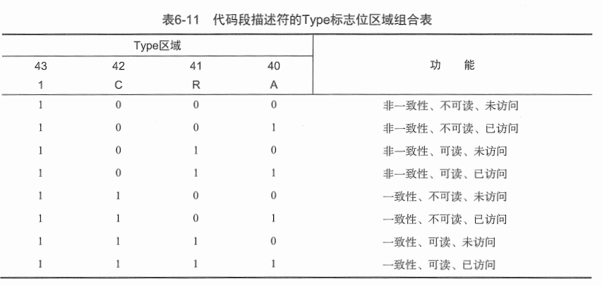

## OS笔记

这个笔记主要侧重于记录我尝试根据各种资料学习写一个极简的OS的过程。

首先列出环境与主要参考书目

之后会拷贝原来写的很凌乱的一些早期的笔记，然后才会继续正题。

要注意的是，这一部分肯定会和汇编语言有很多的联系，所以有些内容可能需要结合汇编语言笔记。那里面写过的东西这里就不会再赘述。


### 环境与参考书目

主要的参考书目是[一个64位操作系统的设计与实现](https://book.douban.com/subject/30222325/)，第二本参考书是[x86汇编语言:从实模式到保护模式](https://book.douban.com/subject/20492528/)。


然后书中建议的是，使用Linux平台，然后需要使用nasm进行汇编的编译，语法的话实际上是Intel语法和AT&T语法的结合，至于原因书中有详细解释，我觉得这样其实很好，从多学一些东西的角度来说。然后c语言的编译器来自于GNU的gcc。另外还有早期的模拟运行环境，明显在早期的时候，需要很多调试，所以直接使用U盘和物理平台结合的测试方法并不合适，于是需要一个虚拟机，这里使用的是Bochs，据说用它的原因是它是一个带了调试功能的虚拟机，这就是和普通虚拟机软件不一样的地方。

为什么会利用Linux作为开发平台呢？其实我并没有找到特别的理由，可能就是Linux上面工具链比较完善。但是实际上我现在使用的是windows平台，主要原因是我不习惯于日常使用Linux，虽然我装了双系统，我也不想通过虚拟机在windows上使用Linux，然后，现在我也得到了一个Linux系统的服务器，但是我在bochs的安装上遇到了问题，安装失败了，原因是bochs的工作必须要图形界面，如果尝试会发现：

> 首先说明一下，环境问题已经说过了，我选择windows平台，之后我得到了帮助，成功在Linux上安装了bochs，但是最终无法运行，`cannot connect x display`这样的，我试过设置配置文件里面的display library为term或者nogui这样的选项，总之目标就是在命令行下使用bochs，结果呢，是不行，提示说这些选项不可用，我不确定原因是处在bochs的源码编译的时候还是bochs本身就要求必须使用图形界面。

总而言之，现在我的工作环境是：

windows，需要安装nasm，然后安装bochs，然后将nasm编译的bin文件写入img的时候，在Linux上面会使用dd命令，在windows上面我构建了一个FAT12的工具。

#### 介质选择

这里说明一下存储介质的选择，存储我们的代码，应该是在一个实体或者虚拟的外部存储装置里，就是磁盘或者映像文件。一开始其实选择虚拟存储设备比较合适，即映像文件`img`，映像文件本身有什么很特别的地方吗？并没有，就是一个全空的文件而已。接下来是选择格式。历史上的存储介质还知道的应该有软盘和硬盘，现在还有Falsh如U盘，现在软盘已经消失了，其中一种经典的软盘叫做1.44M软盘。这里我们选择使用模拟的软盘结构，在试验阶段(虚拟机阶段)，后面肯定会改造为U盘。

这些不同的介质，读取的方式是不一样的，读取的驱动不同，存储结构不同，复杂程度也不一样。但是为什么选择模拟软盘，最大的原因就是够简单，而且bochs自带读取软盘的驱动。

这里解释一下介质选择，后面关于结构还会做更多的解释。


bochs需要一个配置文件，这里我从网上搞到了一个极简版的配置文件：

```
megs:32

romimage:file=$BXSHARE/BIOS-bochs-latest
vgaromimage:file=$BXSHARE/VGABIOS-lgpl-latest

floppya:1_44=a.img,status=inserted

boot:floppy

log:bochsout.txt

mouse:enabled=0

keyboard: keymap=$BXSHARE/keymaps/x11-pc-de.map
```

保存为`.bxrc`文件即可。

然后要使用bochs生成一个img光盘文件。过程在书中有细致描述，不再赘述了。我构建的工具也有这个功能，不需要bochs的帮助也行。

按照参考资料的说明，我们应该使用bochs生成img映像，但其实我很怀疑这样的意义，也曾做过一些探究：

> 然后就是映像的问题。
>
> 问题在于，第一，为什么要特别使用bximage创建映像，为什么要特别选择fd或者hd？第二，dd有什么很特别的地方吗？第三，书中很快就开始使用了FAT12文件系统，已及mount挂载命令，这一切又有什么不同的？
>
> 这里，我想介绍一个windows平台下的工具--winHex，这个工具可以让我们查看任意文件的原始二进制内容。
>
> 首先就是第一个问题。选择fd或者hd发现最终得到的文件都是img文件，唯一的区别就是可选择的文件大小不同，用winhex检查，可以发现无论怎么搞，创建完之后得到的都是一个img后缀的，特定大小的文件，文件内容，所有的字节都是0，没有任何特殊信息。
>
> 所以这让我很怀疑bximage存在的意义，以及搞这些复杂选项的意义，事实上使用python我完全可以自己做到这些。
>
> 第二个问题，已经知道，boot.asm只是为了搞出一个512字节的完全指定信息的bin文件，也就是说boot.bin文件就是一个512字节的二进制文件，其实也的确知道dd命令只是原样将这512字节写入a.img的头部，即前512字节，作为主引导扇区。使用winhex检查也是的确如此，并没有任何特别指出。同样的这个过程使用python也完全可以实现。
>
> 第三个问题让我也非常的疑惑，我的步骤是首先，我知道这个挺复杂的，对于完全不懂的我来说，所以我会首先尝试直接使用书中提供的源码，先跑通了再说。然后我就被卡到了，cygwin无法使用mount挂载命令，经过一番搜索，网上的说法cygwin只是尽量在win上面模拟出一个linux环境，但是后面用的还是win提供的接口，总之就是mount就是不太能行。于是该怎么办？我完全不懂这个过程是在干嘛，自然我也不知道该使用什么工具在win上面完成这个过程。于是我采用了很无奈的迂回策略，我会在linux上面完成全部过程，然后把得到的img再弄回win，然后再跑。现在的结论是，我终于跑通了。
>
> 接下来要做的就是通过winhex进行对比，搞懂这个过程实际上到底干了什么，搞懂FAT12文件系统，然后努力使用python取代这一系列的费劲的命令。进行ing....

关于我制作的python工具会放到后面说一下。

#### 启动虚拟机

可以先试用书上提供的第一个boot.asm，得到bin，写入img，搞好bochs的配置文件，然后运行`bochs.exe`，选择load加载配置文件，然后start即可运行，一切顺利的话应该就能看到start boot这样的输出。

需要记得的是，无论boches.exe目录在哪，它在寻找img文件的时候，都是相对于配置文件的目录的。


### 一些预备知识

第一部分，我需要知道计算机是如何启动的。

我的参考文献和博客很杂，这里不再一一举出。

只是这一块主要来自于[这篇博客](https://blog.csdn.net/langeldep/article/details/8788119)，下面的内容基本完全来自这篇博客，只是精简了而已。

整个启动过程分为四部分，其中第一部分可以认为是由硬件制造商控制的，属于硬件自动执行的，我们无法接管。其余三部分或多或少都能控制。

这四部分分别是BIOS,MBR,硬盘启动，操作系统

#### BIOS

电脑中有一块ROM，其中刷写着开机程序，第一件事就是执行这里面的程序，这个程序叫BIOS，全称Basic I/O System

BIOS其实包含了很多功能模块，首先他会执行硬件自检(Power-On Self-Test)，检查硬件是否满足开机需要，没有问题的话，BIOS会从启动顺序里面找到开始执行下一阶段启动程序的设备，这就是我们会设置的启动顺序。

依次尝试各设备，直至成功启动

#### 主引导记录(MBR)

启动顺序中的存储设备都有特殊的存储结构，具体而言就是存储设备的第一个扇区512个字节必须是一段主引导记录(Master boot record)，这512个字节有特定的结构，计算机会首先取出这前512字节放入内存指定位置。

由于MBR只有512字节，因而内容有限，主要作用就是告诉计算机去何处寻找操作系统。

对于第一顺位的存储设备，计算机先读取其MBR，之后会检查511和512两个字节，只有当这两个字节内容为`0x55 0xAA`的时候才会继续，否则换第二个存储设备

硬盘是可以分区的，每个区都可以安装不同的OS，主引导记录需要知道应该将控制权交给哪个分区。

#### 启动次序

首先，BIOS读入512字节进入内存自`0x7c00`的位置(0x7c00的位置是怎么定的，可以从网上看一些资料)。

因为512字节放不了多少东西，所以这个文件的主要目的是加载更多的程序进来。这个代码称为boot，此时的CPU工作在实模式，也就是16位模式，实模式下的地址是16位段寄存器左移四位加上16位段内偏移，构成20bit寻址空间，这些不再赘述，我觉得这些应该被纳入汇编的常识中，而不是OS，所以关于很多必要知识这里都不会赘述。

boot代码将一部分新的代码加载进入内存，然后跳转执行新的代码，这些代码的主要任务是加载更多代码，以及获取一些硬件信息，以及让CPU的工作模式从实模式进入保护模式，然后进入64位模式，这一部分的代码称为loader。为什么需要一个loader？主要原因是boot工作在实模式，此时寻址空间只有1MB，这一段空间能放的数据不多，所以不可能直接把kernel加载进来，而且进入内核之前也有很多设置要做，所以分离设置一个新的代码更加合适。loader完成必要的设置之后就会跳转进入内核。

内核之后我们就可以开始做更多有趣的工作，例如显示，图形化，内存，进程管理等等。

#### 1M内存空间中地址分配

内存的分配情况是：

`0x00000---0x9ffff`是常规内存

`0xa0000---0xeffff`是320KB的外围设备寻址空间，其中包含显卡的空间，具体的`0xb8000---0xbffff`这一段是显卡的

`0xf0000---0xfffff`是ROM-BIOS的地址空间


### Boot

bootloader都很依赖BIOS，依赖BIOS的功能实现输出，读盘等功能。这些统统依赖BISO的中断实现。这一块需要使用NASM汇编实现。

我认为，应该规范化汇编代码的实现，例如使用函数，规范传参，以及局部变量空间。所以，我要参考GNU函数的设计和传参方式。

然后提供的函数主要包括了清屏，输出，读盘。

这里主要借鉴了c的传参方式，即堆栈传参。

需要决定的第一个问题是，堆栈应该建立在哪里？这个问题对我而言其实有点棘手，我知道应该尽量保证堆栈不会和任务、数据代码冲突，但是考虑了一下好像没有特别安全的地方。所以我决定直接借鉴参考书上的设定，`ss`寄存器设置为`0000h`，`sp`寄存器设置为`7c00h`，因为堆栈是从基址开始反向增长的，所以和bootloader是不会冲突的，但是0x7c00之下的内存区域还是有别的代码的吧，略纠结，但是暂时就这样了。

然后需要特别声明的是：

- 堆栈的段寄存器是`ss`，偏移寄存器是`sp`，也就是`sp`是堆栈指针

- 堆栈自指针开始向下增长，即执行push的时候，`sp`会减小

- 在实模式下(16位模式)，堆栈的push和pop是以word为单位的，即每次push和pop都是以两个字节为单位的，所以我这里直接规定参数的长度都是一个字。

- 当使用mov从某一个地址取数据的时候，是从地址向高地址获取的，例如`mov ax, 0x7c00`，那么ax寄存器获取的是`0x7c00和0x7c01`两个位置的内容

- 按照我现在的设计规范，对于函数的调用统一使用`call`的方式，然后参数按照约定的顺序，自左向右依次压入栈。

- 需要特别注意，当使用`call`调用函数的时候，栈内会被再压入一个当前地址。所以此时的内存应该是这样的：

    ```
    ----------  
    |  ..... |   高地址
    |  ..... |
    |  ..... |
    |   arg1 |
    |   arg2 |
    |   arg3 |
    | addres |  <------   SP
    ```

所以，我的设计是这样的(这里也借鉴了c的方式):

```
函数模板如下：
func_name:
	push bp     ;保存bp
	mov bp, sp  ;使用bp保存当前sp
	pusha       ;保存所有寄存器
	......
	......      ;任务代码
	
	mov ax, [bp+2]  ;将返回地址暂存ax
	mov [bp+8], ax  ;将返回地址存储到arg1的位置
	popa            ;恢复所有寄存器
	pop bp          ;恢复bp
	add sp, 6       ;将堆栈指针恢复到arg1的位置，相当于弹出了所有参数，但是返回地址依旧在此处
	ret             ;返回
	
其中在任务代码部分，获取堆栈内的参数使用相对bp的寄存器偏移寻址。
```

函数参数获取规范：

```
[bp+4]获取最后一个参数
[bp+6]获取倒数第二个参数
依次
```

将返回地址存储到最后一个参数地址那里也需要注意要按照参数数量配置。

以及最后sp指针的`add`也需要按照参数数量配置，`add`的数量就是参数占据的字节数

#### 几个函数的设计

`clean_screen`

这个函数用于bootloader里面使用BIOS中断进行清屏，函数原型应该是：

`void clean_screen(word left_upper, word right_lower, word color)`

所以函数如下：

```assembly
clean_screen:
	push bp
	mov bp, sp
	pusha

	mov ax, 0600h
	mov bx, [bp+4]
	mov dx, [bp+6]
	mov cx, [bp+8]
	int 10h

	mov ax, [bp+2]
	mov [bp+8], ax
	popa
	pop bp
	add sp, 6

	ret
```

一个调用过程如此：

```assembly
	push 0000h    ;左上角(00h, 00h) 顺序是和寄存器相匹配的，寄存器规定CH，DH是列号
	push 090fh    ;右下角(09h, 0fh) ，所以前面是列，后面是行
	push 4000h    ;颜色是40h即红色，虽然BL没用，但是必选按字传入
	call clean_screen
```

另外一个设计规范是关于局部变量的使用，按照书里面给出的规范，应该使用堆栈

我现在已经完善了关于寻址的段寄存器的使用，局部变量的使用。具体细节这里都不再继续说了，可以直接去看functions.asm和boot,loader里面的函数设计。


#### BIOS中断

int10h AH=06h AL=00h覆盖屏幕指定范围为指定颜色

BH指定颜色，CH指定左上角行号，CL左上角列号，DH，DL是右下角。


AH=02h 可以设定光标位置，DH行，DL列，BH页

AH=13h 用来输出，细节可以自己搜一下


int13h AH=00h用来重置磁盘驱动器

需要依赖的重要中断一个是显示，另外一个最最重要的是读盘。显示和清屏的功能已经被我包装为函数，直接去看源码就好。

关于读盘，这里需要花费很多篇幅解释，因此下面单开一部分。


### BIOS读盘

首先说一下模拟的软盘结构。我们的软盘定义必须要适配BIOS的软盘驱动，所以格式如下。

#### 软盘结构与BIOS读取

软盘大小是1.44M，这里的说法其实不太准确，其实他是1440KB，也就是1440*1024=1474560字节。软盘两面都可以使用，也就是两个磁头，每面有80个柱面，每个柱面包含18个扇区，每个扇区512字节，这就是软盘大小的来源。

共2880个扇区，编号从0到2879，这是LBA即逻辑寻址方式，在BIOS进行磁盘读取的时候，使用的是CHS格式的编号，即柱面，磁头，扇区。

两者转换的时候，自然必须知道扇区的编号方式。

柱面是最高级的目录，编号0到79，每个柱面包含两个磁头，编号0和1，每个磁头18个扇区，编号1到18。

怎么把LBA转换为CHS，这一块我看的书上的公式是错的，正确的公式如下：

```
LBA/18 = 商Q,余数R
R+1=扇区号
Q>>1得到柱面号
Q&1得到磁头号
```

关于BIOS使用哪个中断读取磁盘，传入哪些参数，可以看一下资料，或者直接看我写的read_sector函数。

#### 文件系统

我们怎么把boot,loader,kernel放入磁盘，一种最简单的方式就是直接按顺序存放，自己知道具体是哪些扇区，然后读就好了，这种方式可行，而且十分简单，但是约定太多，扩展性太差，肯定还需要一些硬编码，并不是一种好方法。

按照书中的逻辑，我们应该使用FAT12文件系统。说实话，真的很难(尤其是对于我的垃圾汇编水平来说)，也真的很方便。这里主要需要解决的问题，首先是什么是FAT12，然后是怎么将文件存入FAT12，然后是怎么让汇编解析FAT12，这些真的很复杂。需要单独说一下。


### FAT12文件系统

直接说一下结论吧。我构建了一个FAT12的工具，用来创建1.44M软盘，以及构建一个fat12文件系统，以及帮我们将文件存入这个文件系统，这个工具用python搭建。具体不再详细说明，感兴趣可以直接去看代码(我确实花了很大一番功夫才做出来，毕竟当时根本不懂FAT12)。

这里面我说的可能有很多错误，例如一些数字是错的，但是都是可以用的。

#### FAT12文件系统结构

这里所说的FAT12文件系统是构建在1.44M软盘上的。

整个文件系统是以扇区为基本单位，进而多个扇区又可以组成一个簇，每个簇的扇区数量应该是2的n次方，数据存储的时候以簇作为基本存储单位，每个簇具体包含多少个扇区可以在主引导扇区配置。

如果一个磁盘是FAT12文件系统，那么它应该分为四个部分，自磁盘开头到最后依次为：主引导扇区，FAT表，根目录区，数据区。

其中主引导扇区占据一个扇区，FAT表占据的扇区数应该和磁盘大小相匹配，根目录区大小和可以保存的目录项相匹配，接下来就是数据区。

FAT12文件系统的头部是512字节的主引导扇区，主引导扇区的结构是非常固定的。

每个扇区一般都是512个字节，FAT12文件系统不以扇区为单位，而是簇，每个簇可以是多个扇区，简单情况下，一个簇就是1个扇区。

头部的512字节包含了一些FAT12的标识符，也包含了很多的相关信息，包括簇，扇区，磁头，柱面等等，其余就是引导代码，也即Boot部分。这些没什么难度，直接看书就行。

头部之后有两个完全一致的FAT表，这两个表每一个都占用9个扇区，每个表都是由表项组成，每个表项12位，这就是FAT12的名字来历，每个表项的值代表了一个数据簇的情况。但是特别的前两个表项并不代表数据簇，而是两个标识项，从第三个表项开始才代表了真正的数据簇，然后数据簇的标号实际也是从2开始的，从这个角度来看前两个表项其实代表了0，1两个数据簇。表项的值可以代表本数据簇是一个坏簇，保留簇，空白簇，文件最后一个簇，文件的下一个簇等这样的信息。

举例，第三个表项代表了2号数据簇的使用情况，如果它的值是3，那么这意味着该文件系统存储的某个文件的第一个簇是2号数据簇，然后是3号数据簇，第四个表项代表着下一个数据簇的簇号，如果是`FF8H~FFFH`那么代表着这是文件的最后一个簇。

总之FAT12文件系统中的FAT表以簇链的形式存储着文件的簇占用情况。

两个FAT表之后是目录表，目录表占用14个扇区，目录表里面的每一项代表着一个文件，每个目录项占用32个字节，其中最重要的内容是文件的名字和后缀，以及在数据区占用的首簇的簇号，文件的长度。其中文件长度是以字节为单位的。

接下来才是真正的数据区，数据区存储着文件内容，以簇为单位，序号如上所述，从2开始。

总之这就是简单的描述，具体的细节可以看[这里](http://blog.sina.com.cn/s/blog_3edcf6b80100crz1.html)

特别要注意的是，目录项里面的的首簇序号占两个字节，文件长度占四个字节，它们都是小端存储方式。

然后FAT表的每个表项占用1.5个字节，但是这1.5个字节并不是连续的1.5个字节，而是以一种特殊的方式重新排列了，具体的可以看上面的链接里面的图。也正是这个让我们自行实现FAT12文件系统的自行实现和读写变得很烦。

所以，到现在为止，我的目标可以有两个，第一彻底读懂书里面的boot代码和磁盘读写方式，第二摆脱bximage,dd,mount,cp这样的命令，利用python实现映像的创建，主引导扇区的写入，loader代码的存入。

只考虑最简单的情况，只写入一个主引导扇区和loader代码，同时创建相应的FAT表，目录表等相应的内容。这个相对比较简单，目录项我也可以简化到只写关键信息，时间，日期什么的都空着就好。最难的部分就在于FAT表的构建，但是其实想明白了之后这也很简单，只需要配合移位操作和位与操作提取出需要的字节，然后重新排列即可。

#### 主引导扇区

主引导扇区简称MBR，在FAT12里面对于MBR的结构有特殊的规定，因为系统要从主引导扇区里面获取到文件系统的概况，才能解析文件系统。

一般而言每个扇区我们定位512字节，主引导扇区也是512字节，FAT12规定了其中前62字节的结构，以及最后两个字节的结构，前62字节用来存放结构信息，最后两个字节是结束标志位，规定值为`0xAA55`，也就是说主引导扇区只有448字节是可以自由支配的。

其中前62字节包含了20个字段，每个字段代表不同的配置信息，长度不等：

| 惯用名称        | 起始偏移 | 长度 | 作用                             | 我的设定值    |
| --------------- | -------- | ---- | -------------------------------- | ------------- |
| BS_jmpBoot      | 0        | 3    | 跳转指令                         |               |
| BS_OEMName      | 3        | 8    | 生产厂商名字                     |               |
| BPB_BytesPerSec | 11       | 2    | 字节数/扇区                      | 512           |
| BPB_SecPerClus  | 13       | 1    | 扇区数/簇                        | 1             |
| BPB_RsvdSecCnt  | 14       | 2    | 保留扇区数                       | 1             |
| BPB_NumFATS     | 16       | 1    | FAT表份数                        | 2             |
| BPB_RootEntCnt  | 17       | 2    | 根目录可容纳目录项数量           | 224           |
| BPB_TotSec16    | 19       | 2    | 总的扇区数                       | 2880          |
| BPB_Media       | 21       | 1    | 介质描述符                       | 0xF0          |
| BPB_FATSz16     | 22       | 2    | 一个FAT表占据扇区数              | 9             |
| BPB_SecPerTrk   | 24       | 2    | 扇区数/磁道                      | 18            |
| BPB_NumHeads    | 26       | 2    | 磁头数                           | 2             |
| BPB_HiddSec     | 28       | 4    | 隐藏扇区数                       | 0             |
| BPB_TotSec32    | 32       | 4    | 如果前述总扇区数为空，可在此记录 | 0             |
| BS_DrvNum       | 36       | 1    | int13h的驱动器号                 | 0             |
| BS_Reserbedl    | 37       | 1    | 保留                             | 0             |
| BS_BootSig      | 38       | 1    | 扩展引导标记(29h)                | 0x29          |
| BS_VolID        | 39       | 4    | 卷序列号                         | 0             |
| BS_VolLab       | 43       | 11   | 卷标                             | ‘boot loader' |
| BS_FileSysType  | 54       | 8    | 文件系统类型                     | ‘FAT12   '    |

这里面需要解释一下保留扇区数，保留扇区数自FAT12的第一个扇区开始，设定为1，代表第一个扇区是MBR，所以必须设置为1。这个值其实也说明了FAT表从第二个扇区开始。FAT表份数设定为2相当于是搞了一个备份。

主引导扇区512字节，占据一个扇区，接下来是FAT表。

#### FAT表

FAT表至关重要，它以簇为单位记录数据区的存储情况，记录的逻辑是：FAT表以表项为单位，每个表项的长度与文件系统有关，FAT12就是12比特，每个表项都是一个簇序号，这也就表明了，FAT12文件系统最多只能索引4096个簇，如果每个簇是512字节的情况下，也就是2M，但是实际情况还要更小，因为有些簇序号是不可用的，如：`000h`代表空簇，`FF0h~FF6h`代表保留簇，`FF7h`代表坏簇，`FF8h~FFFh`代表是文件的最后一个簇。


1.44M软盘一共包含2880个扇区，每个簇如果定义为1个扇区，FAT12下，就一共需要至少2880*12=34560bit=4320B=8.4375扇区的FAT空间，所以FAT表定为了9个扇区。


文件如何使用FAT表来索引呢？目录区会存储一个文件的首簇序号，然后取FAT表里面找，FAT表里面的每个项都是下一簇的序号，这样链式的搜索知道发现`FF8h~FFFh`就代表文件结束了，然后根据簇序号取指定扇区就可以了。

在整个磁盘中，第1个扇区是MBR，接下来18个是两个FAT表，再接下来的14个是目录区，所以数据扇区是从第34个扇区开始的。但是在FAT12文件系统的FAT表中，第一个数据扇区的簇序号实际上是2，0号簇用来标识BPB_Media，1号簇是FFFh。

总而言之，FAT表中的第n个表项代表了第n个数据簇(序号从0)开始，但是前两个表项的值是固定的，不能用来索引数据，所以真实的数据扇区的FAT项编号从2开始，所以FAT表项等于2代表第34个扇区.

#### 目录区

目录区占据14个扇区，目录区的基本单位是目录项，每个目录项是32B，这32字节依次为：

```
8B文件名  3B扩展名  1B文件属性  10B保留位  2B最后一次写入时间  2B最后一次写入日期  2B起始簇号  4B文件大小
```

文件名和扩展名规定必须是大写ASCII，长度不足用空格`20h`填充

FAT12文件系统的详细结构基本到此应该是已经说完了，这些只是也应该足够写一个读写，解析工具了。但是其实并没有结束，FAT表的构造要比前面说的再复杂一些。


#### FAT表深入

每个FAT表项占据1.5字节，12bit，每两个表项占据3个字节。这三个字节按照半字节排序，可以得到1-6，6个半字节。其中1，2，4号按照412的顺序组合成为第一个FAT表项，3，5，6按照563的顺序组合成为第二个FAT表项。


我认为关于FAT我说的已经够多了，最重要的还是实现问题，可以去直接看我封装好的函数，然后我其实写了两个版本，一个版本是应用于boot的，另一个用于loader，因为loader的每加载一个扇区就必须进行一次转移。


### Loader

有了boot的铺垫，loader应该会稍微好一点(虽然事实上也很麻烦)。

loader要执行的任务第一个是加载内核，第二个是查询必要硬件信息，然后设置VBE显示格式，接下来是完成运作模式的跳转，最后一步是跳转进入内核。

#### 加载内核

加载内核简单吗？其实并不，这里并不是只依赖简单的已完成的函数就能完成，主要原因是kernel可能很大，实模式只能寻址1M内存，可能根本不够。那么就跳出实模式呀。也不行，因为只有在实模式才能使用BIOS的读盘中断。很棘手，对吧。解决的方法其实也有，例如实模式读盘，保护模式转移，不停切换，但是还有更好的方法，现在的CPU有一种工作模式，叫做Big real mode或者Unreal mode，感兴趣可以搜索一些资料来看。但是我觉得如果了解保护模式寻址方式，应该大概就能理解。

简而言之，Big real mode可以让我们使用BIOS的功能，同时也能通过特殊手段访问超过1M的空间。具体资料自己看。

这里我们使用这个模式，然后循环读取和转移内核到1M空间。

这一部分已经包装成为函数，可以去看。

这里面当然有很多知识并没说，例如如何进入这个模式等等，可以直接去看资料。这里只额外提一下A20总线：

> 根据我现在搜集资料得到的知识，我先对这个问题做一些解释，当然，可能我的某些说法是错的，但是。。。还是写一下吧。
>
> 首先，要说明一个重要的原则问题，intel的CPU得以占领市场的的非常重要的一个原因在于：兼容。新的CPU总是可以兼容旧的芯片，也正是因为要保持兼容，所以有很多设计其实是为了实现兼容的无奈之举。A20就是其中一个。
>
> 早期的地址线只有20根，寄存器都是16位的，此时的模式称之实模式，我之前写的这些都是在实模式下的东西。实模式一个重要的特点是寻址方式，这个已经很熟悉了，就是段地址左移四位加偏移地址的方式，这样构成一个20位的地址。但是明显这种寻址方式可能的最大地址并不是fffffh即ffff:fh，而是ffff:ffffh，那么如果程序员真的写了一个超过fffffh的地址怎么办？CPU自动使用了一种称之回绕的技术，其实似乎就是取余。
>
> 后来的CPU具有了超过20根的地址总线，具有了更强的寻址能力，那么此时应该怎么办呢？直接不考虑回绕技术吗？不行，因为要保持兼容，据说其实会有很多程序员在设计代码的时候利用了回绕技术。那么处理的方式就是默认采用回绕，无法利用更多的地址线，但是会特别设计一个开关，负责打开A20地址线，取消回绕。
>
> 总而言之，跳出实模式，第一步必须开启A20地址总线。如果不开，第21根地址总线将无法使用，对此[这一篇博客](https://blog.csdn.net/PacosonSWJTU/article/details/48005813)说的很详细。
>
> 至于开启方式，书中说的很仔细，这里不赘述。
>
> 这只是开始，这一部分，我建议参考第二本参考书，第一本参考书写的太不详细了。

然后之前写的Unreal mode的笔记也摘录如下：

> 这里的unreal mode其实就是big real mode的另一种叫法。
>
> 首先，我测试了这样的做法：开启A20总线，然后在寻址里面使用eax寄存器作为偏移，这样实际上得到了一个32位的偏移量。但是在实模式下虽然可以使用eax，但是并不能使用eax作为内存寻址的偏移，这样会直接导致BIOS陷入错误状态，无法自拔。
>
> 所以，总而言之，Unreal mode是必须的。
>
> 这里应该去看一下维基百科上面`Unreal mode`的词条，里面就提到了：
>
> > Starting with the 80386, real mode programs can use the 32 bit registers with the Address Size Override Prefix.[[7\]](https://en.wikipedia.org/wiki/Unreal_mode#cite_note-X86-64-7) This allows programs to use an address like DS:[EAX]. In normal real mode, a fault occurs if EAX exceeds 0xFFFF. In unreal mode, the access is allowed.
>
> 所以，Unreal mode还是有需要的。
>
> 其实，我们可以放弃这种方式，首先在实模式读取一个扇区，或者多个扇区进入1M以内，然后转入保护模式，搬运至1M以外。但是这种做法并不推荐，很蠢。
>
> 总而言之，Unreal mode还是有需要的。
>
> 那么下面的问题实际上就转换成了，什么情况下我们才能打开Unreal mode。于是下面就要详细说明一下这个模式了。
>
> 对于高级的处理器，指32位或者64位的处理器。它也是可以运行实模式的，这是必须的。然后实际上在这些处理器上，当进行内存寻址的时候，CPU都是从描述符高速缓存中取得段地址，加上偏移地址得到内存地址的。这一点要记得，非常关键。
>
> 另外一个机制是，当这种处理器运行在实模式的时候，当我们修改段寄存器的内容时，CPU会自动将新的段寄存器的内容左移4位传送到描述符高速缓存中，之后当进行内存寻址的时候就使用这个高速缓存的内容和偏移相加进行寻址，所以表现出来的就是实际内存地址是段寄存器左移四位加上偏移，但实际上的工作过程是上面这样的。
>
> 接下来极重要，但是也很明显的是，CPU只会在我们修改了段寄存器的内容之后会刷新高速缓存的内容，如果段寄存器内容不变，那么高速缓存的内容也不变。
>
> 然后，在保护模式下，CPU同样会在修改段寄存器内容之后刷新高速缓存，但是和实模式不同，这里CPU会自动把段寄存器的内容作为段选择子去GDT里面找到一个段描述符，然后把需要的内容加载进入高速缓存。
>
> 如果此时，我们退出保护模式，那么带来的好处实际上是只要退出之后我们不对段寄存器做任何修改，那么之后如果我们使用这个段寄存器进行内存寻址的话，按照之前的逻辑，他还会直接使用高速缓存，但是这时从高速缓存中取得的段基址实际上变成了32位的了，然后CPU在某些机制的作用下就会虽然处在实模式，CPU也开始接受了eax作为段偏移，也就是开始接受了32位的段偏移。
>
> 而如果不进行上面的操作的话，或者我们在退出保护模式之后再次修改了段寄存器的话，它的内容会再次被刷新为左移四位的基址。然后CPU也将不再接受使用超出0xffff的eax作为段偏移。
>
> 
>
> 我觉得到这里已经说得够清楚了，其实对我来说Unreal mode最关键的点是赋予了可以使用32位段偏移的能力。
>
> 
>
> 于是可以总结开启方法：
>
> 1. 完全开启保护模式
> 2. 修改一个想要的段寄存器, 在里面存入一个段选择子，这个选择子所对应的段的基址就是以后要用的段基址，所以可以说很重要，当然其实把它弄成0x0000000000000000最好，这样最方便。
> 3. 跳出保护模式，但是除了修改CR0以关闭保护模式之外，不要修改任何的东西，例如不要关闭A20总线，更不要修改上面的段寄存器，这个至关重要。然后如果需要使用中断的话，打开中断。
> 4. 当需要寻址超过1M的空间的时候，使用上面的段寄存器作为段基址，但是依旧绝对不要修改它的内容。然后段偏移我们可以自由决定，可以使用eax这样的32位寄存器，也可以使用ax这样的16位寄存器。当然前者应该是我们一般情况下最需要的选择。
>
> 这就是Unreal mode，以上内容都已经经过验证，至少在Bochs上面是正确的。

要注意的是，在实模式下，实际是可以使用32bit的寄存器的，例如edi, eax什么的。


#### 硬件信息与设置

这一部分重要吗？当然，但是实际上我并没有太多心情处理这些，因为只是在bochs平台的话，不关注太多这些信息也能继续前行。所以这里我的代码基本就是简化，和直接摘抄参考资料的代码。

录下一点之前的笔记：

> 获取物理地址空间的信息主要依赖BIOS的int 15h中断，这个的操作逻辑自然也是先要设置一些寄存器，然后还要指定一个结果存储位置，按照书上的说法似乎是每次返回20B的结果，但是可能总的结果不止20B，所以要根据标志位决定是否需要循环执行。总之按着来做就行了，参考3.2.2和7.2。
>
> 获取物理地址信息还是挺简单的，只是现在我还不知道能拿这些东西干什么。
>
> #####  
>
> 这一个有点麻烦。
>
> 首先是一些名词VBE,SVGA什么的，虽然我也查了一些资料，但是其实并没有什么准确的认识。
>
> 这个阶段要分为两部分，分别是获取VBE信息，和设置VBE信息，二者都是通过BIOS的 int 10h中断实现的。
>
> 要求，首先只要是在处理VBE，无论是获取信息还是设置，都必须将AH设置为4Fh，然后具体是用什么功能通过AL来指定功能号。
>
> 然后，结束之后，都会有一个返回值来标识执行的结果，这个返回值储存在AX寄存器中，大概说一下AL等于4Fh代表支持该功能，AL等于00h代表操作成功。细节看书上的表7-6即可。总之成功的话AX应该是`004fh`
>
> 按照书上的代码，他使用了`00h, 01h, 02h`这三个功能号对应的功能。
>
> 其中的`00h`功能是用于获取VBE的控制器信息
>
> 这个功能很简单，只需要指定ax寄存器为`4f00h`，然后获取的信息将存储在`es:di`位置，结果如上所述，通过ax指示
>
> 其中`01h`功能用于获取VBE模式信息。这个是真的有点复杂，好像还需要结合前面的得到的控制器信息来做，所以，暂时跳过吧。
>
> 
>
> `02h`号功能用来设置VBE显示模式。
>
> 这一个也有点复杂，AX寄存器应该是`4f02h`自然，然后通过BX寄存器指定要设置的内容，BX是双字，也就是16位的，其中低9位用来指定模式号，其中的第9位是0代表这不是VESA定义的功能号，反之是的，所以功能号一般是写成三位16进制的，但是最高位实际上只对应一个二进制位，自然只能是0或者1.
>
> 然后其它的位代表的信息也很复杂，看一下书里面的表格7-20吧
>
> 我这里选择BX等于`4143h`，其中`143h`模式代表800列600行，32bit点宽的显示模式。在新的显示模式下，原本的显示肯定不合适，所以内存就没有要保留了.
>
> 这一部分我到现在为止只算是大概做了一下，更详细的需要看很多资料，就是书上第7章的VBE部分，我现在并不想看。
>
> 
>
> 硬件信息的获取与设置，暂时到此为止。
>
> 

关于代码流程，这里其实并没有说太多。具体可以看资料。

到现在为止，我决定先分岔，解释两个问题，首先是所谓`.org`，第二个是bochs的调试功能的使用，后者相当重要，基本上对于汇编代码的debug，只能依赖它。再然后开启下一部分的时候会将一些关于保护模式和64位模式的知识，但是需要知道的是，这些知识十分十分复杂，根本不可能细讲，因此笔记中会注重于一些重点和一些重要图表的记录。


### 关于`.org`

在boot里面，我们使用了`.org`，但是它到底是什么，到底有什么用？我早期一直很困惑，做了一些探索工作和笔记，这里摘录一下，最后会给出我现在的结论。

> 已知BIOS的最后，会读取一个扇区的数据进入内存的指定位置即`0x7c00`处，同时会设置`cs和IP`两个寄存器。这里看起来其实`boot.asm`里面设置`org 0x7c00`似乎没有什么意义，至少对于原本的第一个boot代码，去掉这一句似乎也没关系，检查编译得到的bin文件，似乎也的确没有区别。具体的更详细的研究可以看[这篇文章](https://blog.csdn.net/judyge/article/details/52333656)
>
> 
>
> 前面说了一点点`org`的问题，但其实当时我并不懂，那里给的参考资料其实说得挺详细的。这里详细说一下。
>
> 首先，我们对比编译完的lst文件和bin文件其实可以发现org这条指令并不对应任何代码，也就说它并不会生成真实的代码。那么说的它指定了程序的起始地址是怎么回事？编译器并没有权利指定程序被加载到内存的哪个位置，或者说至少org指令没有这个能力。
>
> 我们说boot代码被加载到了`0x7c00`处，这是BIOS自身的功能，无论boot代码写不写org，它都会被加载到这个位置。所以其实`org`写不写都一样，boot都会被加载到`0x7c00`，然后cs与ip配合从这个位置逐条往下执行，直到发生了引用，就会出问题了。
>
> 例如：
>
> ```
>  52 00000035 58                      	pop	ax
>  53 00000036 BD[4300]                	mov	bp,	StartBootMessage
>  54 00000039 CD10                    	int	10h
>  55                                  
>  56                                  ;=======	reset floppy
>  57                                  
>  58 0000003B 30E4                    	xor	ah,	ah
>  59 0000003D 30D2                    	xor	dl,	dl
>  60 0000003F CD13                    	int	13h
>  61                                  
>  62 00000041 EBFE                    	jmp	$
>  63                                  
>  64 00000043 537461727420426F6F-     StartBootMessage:	db	"Start Boot"
>  64 0000004C 74                 
>  65                                  
>  66                                  ;=======	fill zero until whole sector
>  67                                  
>  68 0000004D 00<rept>                	times	510 - ($ - $$)	db	0
>  69 000001FE 55AA                    	dw	0xaa55
> ```
>
> 上面是lst文件的部分内容，其中的53行明显我们把字符串的地址赋给了bp寄存器，明显这是一个偏移地址，无论加不加org，得到的lst文件都是一样的。但是bin是不同的，对比一下可以发现加了org之后这个位置变成了`437c`，没加则是`4300`，这意味着什么。其实这意味着org实际上改变的是偏移地址，如果没有org，就认为程序起始自`0x0000`，那么这个偏移地址自然就是`4300`，加了`org`，就认为程序起始自`0x7c00`，于是偏移地址就改了。
>
> 但是这个地址有点诡异，似乎，为什么是`437c`，而不是`7c43`，这大概和大小端存储有关。我们可以通过bochs的debug确认一下。
>
> 首先可以`break 0x7c35`，因为我们知道程序起始自`0x7c00`，那么上面的52行的地址一定是`0x7c35`，然后使用`s`逐步执行，再使用`r`和`sreg`分别查看寄存器和段寄存器的值，通过资料可以知道boot代码显示字符是通过调用int10的功能实现的，这个功能在显示字符串的时候字符串的地址通过`ES:BP`指定，查看寄存器可以发现`ES`的值总是`0`，那么BP就自然必须是`0x7c43`才能正确的指到字符串所在位置，对比可知当设置了org的时候BP的值如我们所想，不设置的时候是`0x43`，这样取到的自然是一个错误的位置，观察bochs的显示也可以发现显示是乱码。
>
> 至此，这个问题算是结束了
>
> 
>
> 题外话，bochs可以逐步执行嘛，所以，其实我们也是可以观察int 10到底干了什么，可以先断点到int的上一条指令，然后逐步执行，就可以看到程序跳转到了`0xc0152`这样的地址去执行了，并且还可以继续`s`看每一步到底干了什么。
>
> 给出一条结论：`Intel`的处理器都采用了小端存储方式

总而言之，我们的代码总会涉及到寻址，其中一种情况，例如要输出代码中的一段文本，mess，那么需要知道它的位置，于是使用label功能标记地址，但是它有一个问题，就是label地址是相对于文件的起始位置的，但是这个文件的起始位置并不放在内存空间的起始位置，这就造成了他们之间有偏差，`.org`可以弥补这一段偏差，他会给label的地址加上一个`org`后面的值，这样就对上了。

所以，不用可以吗？当然，只要不涉及到这种寻址就可以不用，我们也可以手动补足这段地址偏差。

还有就是，根据我的测试，实模式下，这个org不能超过16bit，所以又是就不得不手动补足。


### bochs的Debug功能

如果要使用调试功能，就要运行`bochsdbg.exe`，而不是`bochs.exe`，前者也是一样的，选择配置文件，然后在命令窗口里面可以输入命令控制执行过程

详细的手册[看这里](http://bochs.sourceforge.net/doc/docbook/user/internal-debugger.html)

[这里还有一个中文版的](https://hoverwinter.gitbooks.io/hit-oslab-manual/content/bochs-manual.html)

还可以看看[这个](http://www.360doc.com/content/18/0418/23/9824753_746767808.shtml)，这一篇讲了debug的使用，同时也说了配置。

简单的记录一下：

- 继续执行：`c`
- 停止：`ctr-c`
- 指定执行的步数：`s n`，n是步数，不指定的话就是1步
- 查看内存： `xp /nuf addr`，这个方式很类似于GDB，n指要查看的单元数目，u是单元大小，例如b就是一个字节，f是显示格式，x就是十六进制，addr自然是起始的物理地址。
- 查看寄存器：`r`，这个列出的寄存器是rax这样的，这是64位的寄存器
- 查看段寄存器：`sreg`
- 退出： `q`，看一下提示信息，说明之后应该还要再回车一下
- 断点：`break addr`，看手册可以发现断点的种类还是挺多的，至于什么虚拟地址什么的我不太懂，这个break是物理地址，也就是说断点设置到了内存的addr位置，例如知道boot代码会被BIOS加载到内存的`0x7c00`位置，所以可以设置`break 0x7c00`，那么再执行`c`，程序会运行到断点处停止，然后我们可以逐步运行`s`，对照输出就可以发现boot代码正在被逐条执行


在我的学习过程中，我首先做的事情其实并不是直接就去学，而是选择首先试一下直接运行书里面的代码，看能不能得到期望的结果，所以这里先说一下我的记录，然后再说知识部分：

### 书中代码的工作方式与模式跳转的检查

这里面都是一些之前的笔记记录，所以有些东西会莫名其妙，也会是错的。摘录一下，留个纪念。

> 首先自动加载MBR，也即boot代码，boot负责加载loader进入内存。加载过程会首先逐个将目录扇区读入8000h处，搜寻loader，直至找到。然后会每次读入一个或者两个FAT扇区进入8000h处，逐步取得loader，将loader逐个扇区存入内存10000h处。至此loader成功加载进入内存，然后跳转进入loader开始执行。
>
> 进入loader之后首先会输出一些文字信息作为提示。
>
> 接下来依次执行：打开A20总线，关中断，存入gdtr，修改CR0寄存器正式开启保护模式。
>
> 问题是：如何才能知道已经进入保护模式？在bochs里面。
>
> 在bochs里面，当我们执行`s`命令，也就是下一步的时候，总是会输出下一条命令的信息，如：
>
> ```
> <bochs:33> s
> Next at t=14785416
> (0) [0x0000000100bb] 1000:00bb (unk. ctxt): mov cr0, eax              ; 0f22c0
> ```
>
> 这里明显可以看到一个地址：`1000:00bb`，根据以前的知识可以知道这是一个16位的段地址和16位的偏移地址，那么这自然是在实模式
>
> 当完成保护模式的开启之后，我们再执行`s`命令，将看到下面的输出：
>
> ```
> <bochs:34> s
> Next at t=14785417
> (0) [0x0000000100be] 1000:00000000000000be (unk. ctxt): mov ax, 0x0010            ; b81000
> ```
>
> 我其实还不太明白为什么这里的地址是64位的，不应该是32位的吗？但总而言之，已经脱离了实模式。
>
> 
>
> 另外一个重要问题。GDT的问题，参考第二本书的关于段选择子的结构描述，我们可以知道，16位的段选择子的第三位是两个标志位，高15位代表着段序号。
>
> 但是有些代码似乎很奇怪，例如书上的代码：
>
> ```assembly
> LABEL_GDT:		dd	0,0
> LABEL_DESC_CODE32:	dd	0x0000FFFF,0x00CF9A00
> LABEL_DESC_DATA32:	dd	0x0000FFFF,0x00CF9200
> 
> GdtLen	equ	$ - LABEL_GDT
> GdtPtr	dw	GdtLen - 1
> 	dd	LABEL_GDT
> 
> SelectorCode32	equ	LABEL_DESC_CODE32 - LABEL_GDT
> SelectorData32	equ	LABEL_DESC_DATA32 - LABEL_GDT
> ```
>
> 这里明显前三个就是三个段描述符，而后面的`SelectorCode32  SelectorData32`分别是两个段选择子，但是，等等。。不太对呀，段选择子不应该按照上面描述的结构构造吗？为什么直接相减就得到了。
>
> 其实，仔细对比一下我们就知道，段描述符每个长度8字节，也就是说实际上是`1000`，总而言之，这实际上刚好和段选择子的结构相符，认为段选择子的低三位都是0，而第二个段刚好是16对应二进制`10000`，刚好可以认为是第二个描述符加上3个0标志位。
>
> 总而言之，段选择子可以有两种理解方法，如果按照标准的理解的话，就是最上面的，但是如果标志位都是0的话，那么也可以认为它是选择了在GDT中偏移为选择子的段选择符。
>
> 在是保护模式下设置fs寄存器，然后跳回实模式。接下来继续利用BIOS搜索和读取内核，然后逐个扇区将内核代码读入一个转存空间，然后再逐字节将这个扇区搬运到`0x100000`开始的内核存储区。
>
> loader的一个重要工作至此搞定，接下来主要是设置和获取一些硬件信息，然后重新开启保护模式，继而跳入IA-32e模式。
>
> 跳回保护模式，这个很简单了，先关中断，再重新搞一次lgdt(其实我觉得没必要了，之前不是搞过一次吗？)，然后处理CR0寄存器。
>
> 接下来要刷新流水线，等。执行一次跳转指令。但是要注意。此时的跳转要符合保护模式下的寻址方法。
>
> 
>
> 保护模式的代码，要另外搞一个段出来，因为这一次要指定`bit 32`，这一个的具体讲解看第二本参考书的`10.3.2`部分，其实我并不是非常透彻的理解。
>
> 进入保护模式之后，下面就是直接为64位模式的跳转做准备，但是这一部分我还不是很清楚，包括长模式检测，页表，以及64位下的GDTR的格式。
>
> 
>
> 我已经看了一点，大概搞懂了64位模式下面的寻址方式，但是关于页表和CR3寄存器的处理依旧有些模糊。但是我试着直接调整了书上给的这一点的代码，然后，现在呢，我终于跑通了，经过验证，程序的确也已经成功跳转到内核执行了。
>
> 但是现在我遇到了一个巨大的问题，前面有说过如何通过bochs观察是否成功进入保护模式，我的确观察到了bochs里面地址长度的变化，以及接下来的寻址方式的使用应该都能证明我进入了保护模式，至少我是这样认为的。
>
> 但是今天当我按照程序完成64位模式的开启之后，在运行内核的时候，我通过`sreg`命令却观察到了如下字样：
>
> ```assembly
> <bochs:2> sreg
> es:0x0010, dh=0x00cf9300, dl=0x0000ffff, valid=1
>      Data segment, base=0x00000000, limit=0xffffffff, Read/Write, Accessed
> cs:0x0008, dh=0x00cf9b00, dl=0x0000ffff, valid=1
>      Code segment, base=0x00000000, limit=0xffffffff, Execute/Read, Non-Conforming, Accessed, 32-bit
> ss:0x0010, dh=0x00cf9300, dl=0x0000ffff, valid=1
>      Data segment, base=0x00000000, limit=0xffffffff, Read/Write, Accessed
> ds:0x0010, dh=0x00cf9300, dl=0x0000ffff, valid=1
>      Data segment, base=0x00000000, limit=0xffffffff, Read/Write, Accessed
> fs:0x0010, dh=0x00cf9300, dl=0x0000ffff, valid=1
>      Data segment, base=0x00000000, limit=0xffffffff, Read/Write, Accessed
> gs:0x0010, dh=0x00cf9300, dl=0x0000ffff, valid=1
>      Data segment, base=0x00000000, limit=0xffffffff, Read/Write, Accessed
> ldtr:0x0000, dh=0x00008200, dl=0x0000ffff, valid=1
> tr:0x0000, dh=0x00008b00, dl=0x0000ffff, valid=1
> gdtr:base=0x0000000000011938, limit=0x17
> idtr:base=0x0000000000000000, limit=0x3ff
> ```
>
> 观察cs那一行，竟然赫然写着32bit模式，我瞬间惊呆了，什么个情况，我真的是有点搞不懂了。
>
> 我现在开始怀疑到底成功进入64位模式没有。
>
> 我不知道该怎么办了。
>
> 我也看了一点第四章的内核部分，代码的编译估计也会成为一个严重问题，因为现在我都没能成功编译。
>
> 
>
> ok，搞定了，我终于成功进入64bit模式了，其实前面的都没问题，只是gdt里面又一次忘记加`0x11400`了，修改之后，在bochs里面可以得到：
>
> ```assembly
> <bochs:49> sreg
> es:0x0010, dh=0xff0093ff, dl=0xffff0000, valid=1
>      Data segment, base=0xffffffff, limit=0x00000000, Read/Write, Accessed
> cs:0x0008, dh=0xff2099ff, dl=0xffff0000, valid=1
>      Code segment, base=0xffffffff, limit=0x00000000, Execute-Only, Non-Conforming, Accessed, 64-bit
> ss:0x0010, dh=0xff0093ff, dl=0xffff0000, valid=1
>      Data segment, base=0xffffffff, limit=0x00000000, Read/Write, Accessed
> ds:0x0010, dh=0xff0093ff, dl=0xffff0000, valid=1
>      Data segment, base=0xffffffff, limit=0x00000000, Read/Write, Accessed
> fs:0x0010, dh=0xff0093ff, dl=0xffff0000, valid=1
>      Data segment, base=0xffffffff, limit=0x00000000, Read/Write, Accessed
> gs:0x0010, dh=0xff0093ff, dl=0xffff0000, valid=1
>      Data segment, base=0xffffffff, limit=0x00000000, Read/Write, Accessed
> ldtr:0x0000, dh=0x00008200, dl=0x0000ffff, valid=1
> tr:0x0000, dh=0x00008b00, dl=0x0000ffff, valid=1
> gdtr:base=0x000000000001195c, limit=0x17
> idtr:base=0x0000000000000000, limit=0x3ff
> ```


可以忽略掉上一部分的，其实。

接下来，说一下，什么是保护模式和64bit模式。

### 保护模式与64bit模式

这个内容其实很大，我到现在并没有全部搞定，但是我搞懂了一些我认为非常重要的一部分细节，还有一些依旧未能解决，我已经在这里耗费了相当多的时间，我决定基本上暂时到此暂停，我接下来会着重于内核。等到合适的时机我也许会再回来。

然后这一块的话，书上面的第三四章其实讲的太过浅薄了，应该看书的第六章。但是我觉得还不够，还应该补充intel的白皮书，我会在需要的位置给出要看的章节。

关于这两种模式，重要的东西当然很多，段管理方式，页表，中断，各种门，TSS描述符等等，但是我觉得短时间内最核心的还是内存的管理以及地址的合成方式。

这里直接使用我的近期笔记：

16位模式又称为实模式，我的理解是，他表示的逻辑地址直接就是物理地址，所以称之实模式。32位模式常称为保护模式，接下来是64位模式。大概粗略的分为这三种情况，接下来说一下这三种模式下，是怎么表示内存地址的。

#### 实模式

实模式下，寄存器是16位的，通过段寄存器左移四位+偏移的方式来表示地址，所以地址最多20位，寻址空间1MB。一个段的长度最大是16位，即64KB。

#### 保护模式

保护模式下，保留了段管理机制和分页管理机制，其中前者是必须的，后者是可选的。当不使用分页管理的时候，分段管理机制得到的线性地址直接就是物理地址，当启用分页管理的的时候，得到的线性地址还必须经过页表转换才能得到物理地址。

此模式下，有两个重要的寄存器，分别叫做GDTR，LDTR，分别是全局描述符表寄存器和局部描述符表寄存器。它们标记了GDT和LDT的位置和长度。

段寄存器的长度依旧是16位，但是其中低3位是两个标志位，高13位是一个叫做段选择子索引的值，顾名思义，他是一个index，13bit最多可以索8192个段选择子。

CPU根据段选择子，去GDTR和LDTR指定的GDT和LDT中查询段描述符，每个段描述符8B。

GDTR和LDTR一共48bit，其中高32为代表GDT/LDT的基址，低16为代表长度。

段描述符8B，其中有被分割开的32位代表当前段的基址，另外有分割开的20bit代表这个段的长度，同时还有一个位来代表段长度的颗粒值，有两个可选值，分别是1B和4KB。前者段最长1M，后者4GB，刚好是32位的全部地址空间。

基本上大概就是这样，还有一些重要的细节后续再补充。

总之，保护模式的段内存管理模式即段寄存器给出段描述符的索引，段描述符寄存器给出段描述符的存储地址，段描述符给出段基址和长度。

#### 64位模式

64位模式也常被称为IA-32e。总之都是那个意思了。

这种模式下，地址位宽64位，但是并不是全用来表示地址。其寻址能力只有低48bit，高16位是符号扩展，它们统统要和第47位保持一致(从0位开始编号)，所以明显，可以表示地址的只有整个64位地址空间的首尾两小段。称之Canonical地址。中间的无效地址称为Non-canonical地址。

64位模式下，地址的转换过程是：首先需要通过GDT配合段内偏移得到64位线性地址，但是其中只有低48位是有意义的。接下来线性地址还必须经过四级页表转换才能得到真正的物理地址。

段描述符依旧是64bit，编号为0到63，在这个模式下，很多位已经被取消了，没有意义，例如段基址段长度还有一些标志位。

现在还有作用的位部分如下，建议看书。

|  位/名字  |            作用             |
| :-------: | :-------------------------: |
| 40 Type A |                             |
| 41 Type R |                             |
| 42 Type C |                             |
|  43 Type  |                             |
|   44 S    |    和32bit模式的意义一致    |
|  45 DPL   |      特权级，意义一样       |
|  46 DPL   |                             |
|   47 P    |         是否在内存          |
|   53 L    | 如果是64位模式，这一位就是1 |
|  54 D/B   |         64位模式是1         |

对于数据段而言，还要更加简单。


在保护模式下，可以选择使用页模式，or not，但是在64bit模式下，必须使用页模式，所以这里有必要先梳理一下大概的逻辑，细节自然是非常多的，全部记录下来，基本就相当于参考书了，所以这里重点关注关键逻辑。

在保护模式之后，段的管理模式要复杂很多，必须使用诸如GDT这样的机制，自不必说。经过段描述符的转换得到的地址称为线性地址，如果是没有页模式，那么线性地址直接就对应了物理地址，如果使用了页管理，就必须再次经过页表的转换。

保护模式下的页表管理方式用三种选择，分别是32位分页模式，PSE模式，PAE模式，它们的一个重要区别在于页表的级别不一样，第一种采用了两级页表，也就是先要从页表目录中得到页表，再从页表中得的页，然后结合页和页内偏移得到物理地址。PSE只有一级转换，PAE有三级转换。

以32位分页模式来说明一下。

称页表目录表为PDT，即page directory table，其中的每一项称为PDE，每个PDE对应一张页表，页表称为PT，页表中的每一项称为PTE，是一个具体的物理页。

在这个模式下，每个物理页的容量是4KB，每个PT包含1024个页，每个PDT包含1024个PDE，刚好4GB.

页目录表的基址存储在CR3这个控制寄存器里面，CR3寄存器也称之为页目录基址寄存器PDBR(page directory base register)，CR3寄存器和页目录项以及页表项的长度都是32bit.


#### 32位与64位地址管理

在32位模式下地址的转换包含段管理机制和页表机制。其中前者是必须的，后者可选。在64位模式下，段管理机制和页表机制都是必须的。

这两种情况下，地址的表示仍然是和实模式下一样，包含一个基址和一个偏移。这种情况下，仍然使用段寄存器，但是段寄存器依旧是16bit。但是段寄存器实际上并不是基址，而是一个段选择子。

使用段选择子从段描述表中选择一个段描述符，这个段描述符中包含的最重要的信息自然就是这个段的基址，同时还包含了很多额外的相当重要的信息位，例如段长，特权级，类型等等。

段描述符中的基址拼接偏移，就可以得到一个线性地址。保护模式下，如果不使用页表，这个线性地址实际上就是物理地址。

当开启页表模式的时候，必须要再将线性地址经过页表转换，最后才能得到物理地址。

#### 保护模式段管理

段描述符集中存在一起，叫做段描述符表，最重要的两种段描述符表叫做GDT和LDT，即全局描述符表和局部段描述符表。但是似乎一般很少使用LDT。

GDT直接存储在内存中，起始位置以及长度存在一个寄存器里叫做GDTR。

GDT里面每个段描述符的长度是8B，各个段描述符紧密相邻排列。但是GDT的第一个段描述符必须是空描述符，不可使用。

段描述符的结果如下所示：


这里面的Type和S等一些字段可以配置当前这个段描述符的类型。

因为最终的目标是64位模式，而且相比保护模式，64位模式的段描述符简化了很多，所以这里就不再详细描述细节了。

但是由于跳转到64位模式必须要经过保护模式，所以还是要构建一些简单的段描述符。

而GDTR的大小是48bit，其中低16bit是GDT的长度，高32bit是GDT的基址。

段选择字的长度是16bit，其中高13bit是段描述符的索引。1，2两位是RPL即请求特权级。第三位是TI即段描述符表的类型。TI=0-->GDT， TI=1--->LDT。

有这些信息应该基本上已经够构建一些简单的保护模式的段管理工具，当然我知道那些标志位我还没说。

#### 64bit段管理

关于段管理的工作方式和保护模式完全一致，只是段描述符被简化了。


这种情况下，段基址都被固定为0，长度的限制都被取消，只有一些标志位还被保留。

这个时候，段选择子依旧保持与保护模式一致。

经过段管理，得到的线性地址是64bit的，但是其中只有低位的48bit是可用的，高16位都是扩展位。

接下来48bit的有效线性地址需要经过页表转换，从而得到物理地址.

#### 64bit页表管理

64位模式下，页表机制只有一种，即四级页表。

|    名称    | 英文名称                     | 英文简称 | 对应的地址位      | 表项名称     |
| :--------: | ---------------------------- | -------- | ----------------- | ------------ |
| 第四级页表 | page map level 4 table       | PML4T    | 40到48，共9位     | PML4E(Entry) |
| 第三级页表 | page directory pointer table | PDPT     | 第31到39，共9位   | PDPTE        |
| 第二级页表 | page directory table         | PDT      | 第22到30，共9位   | PDTE         |
|    页表    | page table                   | PT       | 第13到21位，共9位 | PTE          |

最高一级的页表叫做PML4T(page map level 4 table)，其中的页表项叫做PML4E(page map level 4 entry)，第三级页表叫做PDPT(page directory pointer table)，其中的项叫做PDPTE，二级页表叫做PDT，项是PDTE，最后一级是PT，项是PTE。

48bit地址中最低的12bit是页内偏移。

PML4T的物理基址的存储在CR3寄存器中，长度64bit，包含了物理基址的一些信息位。PML4E，PDPTE，PDTE，PTE的长度都是64bit，都是包含了地址和信息位。

在CR4寄存器中有一个位叫做PCIDE，这一位设置为0/1时，CR3的表现不太一样。这里说的不一样主要指的是它的一些标志位不同。

虽然线性地址的有效位只有48位，但是实际上现在的CPU的寻址空间大都大于48位，而且不同版本的CPU不太一样，有的就是48，有的是52。所以通过CPUID指令，可以获取一个MAXPHYADDR，最大值是52，有的也会是32。在CR3中存储着PML4T的物理基址，所以这个的长度就不一定了。无论PCIDE是多少，CR3中基址总是从第13位开始(计数从1开始)，长度就是M-12。

这样其实很明显，CR3当中并不是一个物理基址，在白皮书卷3的4.5部分有说，假设我们已经有了一个线性地址，那么应该如何寻找PML4E的物理地址：假设M=52，那么物理地址的13到52位就是CR3中的数据，12到4位就是线性地址中的9位，低3位固定为0(PML4E以8B对齐)

在其它Entry中，对应的位置其实和CR3的意义类似，都是一个基址，对应的项的地址也都是这样拼接出来的。

如果是4KB的内存页，那么其实就是这样逐级拼接转换，最终加上12bit的页内偏移就可以了。

但是其实还支持2MB的内存页，这种情况下，需要21bit表示页内偏移，其实刚好是最后一级的页表没了。那么这种情况下，PDE中22到52这31位代表的就是最终的物理页的前31位，然后拼接上21位页内偏移，组成了52位的真实地址。

然后因为，下一级项的实际地址是线性地址中的9位地址左移3bit产生的，而且项的长度刚好是8B，即3位，所以其实认为线性地址中的是项的index更好理解。


上面说的东西先不说他是只涉及了内存管理，完全没说系统段，中断等部分，单是内存管理也很割裂，远不全面，所以还是结合书一起看最好。


下面我截取一些对我而言，在解释GDT，页面的时候非常重要的图表，便于我以后转换。

#### 转换时需要的字段图表





呃，还有一个什么想记录的点来着，有点忘了.......

页表的设计部分，我现在基本上完全是抄的参考资料的代码，我还不打算重写。


这一部分先到此为止吧，我会在代码上加尽可能多的注释。直接开始内核吧。


内核部分的内核头部使用了一段汇编代码，主要目的是正式设置一下页表，IDT，GDT，TSS什么的，如上所述，这一部分现在我只是加一些注释而已。

### 内核头

关于内核头，首先说明一点。

~~~assembly
lgdt	GDT_POINTER(%rip)

......

.section .data

.globl GDT_Table

GDT_Table:
	.quad	0x0000000000000000			/*0	NULL descriptor		       	00*/
	.quad	0x0020980000000000			/*1	KERNEL	Code	64-bit	Segment	08*/
	.quad	0x0000920000000000			/*2	KERNEL	Data	64-bit	Segment	10*/
	.quad	0x0020f80000000000			/*3	USER	Code	64-bit	Segment	18*/
	.quad	0x0000f20000000000			/*4	USER	Data	64-bit	Segment	20*/
	.quad	0x00cf9a000000ffff			/*5	KERNEL	Code	32-bit	Segment	28*/
	.quad	0x00cf92000000ffff			/*6	KERNEL	Data	32-bit	Segment	30*/
	.fill	10,8,0					/*8 ~ 9	TSS (jmp one segment <7>) in long-mode 128-bit 40*/
GDT_END:

GDT_POINTER:
GDT_LIMIT:	.word	GDT_END - GDT_Table - 1
GDT_BASE:	.quad	GDT_Table
~~~

这一块，明显GDT_POINTER这个label标记的是预先设计好的GDTR内容的地址，开头的部分使用了相对寻址，但是这个相对寻址似乎很诡异，为什么是相对`rip`偏移`GDT_POINTER`而不是直接`GDT_POINTER`，这种以`RIP`作为寻址基址寄存器的相对寻址叫做`RIP相对寻址`，是64位编程特有的寻址法。我搜索了不少关于这种寻址的资料，但是依旧感觉很莫名其妙，明显感觉跟我们想要的不一样。

在求证了参考资料作者之后，我确认此处的`GDT_POINTER(%rip)`等价于`GDT_POINTER`，那么为什么不直接写`GDT_POINTER`呢？因为直接写会报错......很神奇


现在正式进入内核了。

但是我立马就遇到了严重的问题，首先是GAS的AT&T语法，要学一下，但是这个其实还好了，花一点时间看看资料就行。

最严重的问题是C，书上采用的开发平台是Linux，C语言的内核和汇编的编译，链接非常复杂，还要自己写连接文件，我到现在还没能搞定Windows平台下的链接，又一次被卡住了。我不确定还能不能搞定。


#### 关于内核头的其他问题

内核头的这一段代码是直接拷贝书附代码的，我加了一些注释，也基本上搞懂了所有的GDT，页表等的一些配置。关于RIP相对寻址前面也解释了。

但是，其实现在还有一些问题，这些问题之前我也探究过，但是终究未能搞定。

具体而言，问题是这样的。在这一份代码中，使用了后半段的Canonical地址作为内核代码运行的线性地址，并且通过页表，把两段Canonical地址映射到了相同的物理地址上。同时内核是加载在物理地址为1M起始的位置，然后在内核的连接脚本中通过定位器把内核重定位到了后半段线性地址。但是其实在内核头运行初期，CS寄存器等依旧会按照原始的物理地址作为value，也就是说还是运行在Canonical地址的前半段，因为这两段线性地址指向了相同的物理地址，所以实际上代码的运行是完全没有问题的。

那么怎么才能让内核跳转到后半段线性地址呢？方法就是，重定位之后label的地址是变了的，只需要执行一些和label相关的操作，或者基于label的跳转就可以了。关于跳转，书里面也讲了为什么要用lretq，关于lretq实际就是ret的64位版本，这里面需要两个堆栈参数，段寄存器和偏移，所以向堆栈push了两个值。

基本的原理，半猜半推理，我认为就是上面的样子。但是我不能确认心里就很不踏实，我想知道连接脚本里面的重定位是怎么实现的，我有尝试过使用objdump查看system的反汇编信息和符号表，但是地址跟推算的根本对不上，Don't Know Why。我希望可以确认这个问题，但是现在还解决不了。


ok， 又已经十天了，这些天里因为一些其他的事情，我很少正经的搞这些东西，所以，进展十分缓慢，但是，值得开心的是，现在我终于已经成功的搞定了内核的编译。所以，下面首先介绍一下进展，然后说明内核编译的问题。

首先，截止到之前为止，除了后面可能会继续优化boot和loader的代码之外，基本上二者都不会有重大的调整，然后loader的最后已经成功进入IA-32e模式，也设置了一些暂时的页表，然后开始跳转到内核处，开始执行内核。也就是进入了第一本参考书的第四章。

按照书上的说明，我们要在内核的前面加一段内核头，这是一段AT&T汇编，主要作用似乎是设置页表，完成一些地址映射？似乎吧，我并没有详细看。然后需要用c语言来写内核代码，然后将汇编和内核链接在一起，形成内核，写入软盘。

现在我并没有真正的学会页表，所以其实这个内核头我并不会写，并且我还没怎么学习AT&T汇编。所以现在的决定就是暂时不管内核头，直接使用作者给出的内核头。

然后第二个问题就是内核C代码的编译与链接。如前所述，我遇到了问题，在windows环境下使用mingw的编译器并不能直接按照作者给的makefile和链接脚本完成编译。这个问题实际比较复杂，我甚至进了作者组建的QQ群，直接去问了作者，但是也并没能直接给出解决方案，我搜索了一下，网上也并没给出什么好的方法，或者不一样，或者可能是我级别太低，根本看不懂。。。。总而言之，我只能再次依靠自己。

所幸makefile我还是看得懂的，所以我可以自己试着改一改，首先发现的问题自然是文件格式，作者使用的环境是`Linux`，所以他的makefile和链接脚本里边使用的都是`elf64-x86-64`，稍微做一些背景知识调查，就可以知道这是`Linux`下面的`x86`平台的`64bit`格式，那么在windows上面自然应该改成`PE`格式，即`pe-x86-64`。


#### PE与ELF

稍微做一些背景知识调查就可以知道这是两种可执行文件格式，分别适用于`win`和`linux`，然后二者其实都来自于`COFF`，这两种虽然一本同源，但是是有区别的，理论上来说实际上甚至可以[纯手工既可以构建出一个PE格式的可执行文件来](https://blog.csdn.net/small_snowflake/article/details/73604619)，但是，现阶段而言这些对我并没有什么意义。总而言之，我所需要知道的就是这两种格式是什么就可以了。


然后书上这一段内核编译这一部分实际上意味着什么呢？

首先继续考察C语言的编译过程，这个问题我已经搞过很多次了，但实际上还是感觉并不太懂，这里再说一下。


#### 编译过程

`GCC`的编译过程可以认为分为四步：预编译，编译，汇编，链接。

源代码是C，预编译只是负责将里面的预编译指令处理一下，展开宏定义，处理include等，我们可以控制只执行这一步，如:`gcc -E hello.c -o hello.i`，这一步的结果，习惯上我们会使用`.i`后缀，但是其实无所谓了。

第二步编译，这一步负责将预编译的结果生成汇编代码，应该是`AT&T`格式的汇编，命令为:`gcc -S hello.i -o hello.S`，感兴趣的话可以通过这一步看看一个非常简单的C代码的汇编是什么样子，当然，里面会包含很多附带部分，都是一些附加的代码，熟悉`AT&T`汇编的话就无所谓了。

第三步汇编，这一步也很简单，只是对照指令表将汇编代码变成机器码，也就是二进制。命令为:`gcc -c hello.S -o hello.o`，当然其实也可以使用`as`来完成，二者是一致的

最后一步就是链接，这一步是将目标文件连接成可执行文件。这一步使用`ld`完成，默认会使用系统自带的链接脚本完成，但让也可以是用自己写的链接脚本。


如果不出预料的话，看完这些依旧会很懵。

这么说吧，我们写一个C代码，经过编译等，生成一个可执行文件，我们实际上可以把他们直接当成一些机器指令来看，这个可执行文件虽然在不同系统进行编译得到的结果不同，但是当这个可执行文件最终被执行的时候，都是直接加载给了CPU，具体的执行的指令可能不是完全相同，但是结果一定都是基本一样的。所以，就是根据这一点，我认为内核的编译在Linux上搞得定，那么在win上面也一定搞得定。

内核这一部分的主题思想就是，首先搞一个汇编的内核头，然后用C写一些功能，我们只需要把C也搞成汇编，然后使用链接脚本将这两份汇编代码拼接在一起，当然内核头应该保证被放在最前面，最先执行。然后把他们编译成一个可执行文件，内核头我们是关注的，但是C代码我们只关注功能，并不关注具体实现，只要我们绝对不使用依赖系统的库就可以。接下来，只需要从可执行文件里面，把我们需要的真正的机器指令抽取出来，构成一个`kernel.bin`文件即可。

就是这么简单，当然其实也很复杂。

复杂之处在于，如果都用汇编来写，我们就可以实现完美的自主控制，但是实在太过繁琐，可使用C来写，虽然方便了，但是我们也丧失了细节的把控力。


唉，还没说到正题。我真的是太啰嗦。

这么说吧，如果只按照前面说的，把作者的内核源码拿来，修改makefile和lds链接脚本里面的文件格式，然后执行make，结果就是会报错，错误大概是这样的：

```
ld -b pe-x86-64 -o system.tmp head.o main.o -T Kernel.lds
main.o:main.c:(.pdata+0x0): relocation truncated to fit: rva32 against `.text'
main.o:main.c:(.pdata+0x4): relocation truncated to fit: rva32 against `.text'
main.o:main.c:(.pdata+0x8): relocation truncated to fit: rva32 against `.xdata'
make: *** [Makefile:20: system.tmp] Error 1
```

这个看着有点懵，但明显错误出在链接这一步。大概是在说`main.o`里面的`.pdata`这个段出现了错误。

但是，经过我的测试，作者的源码在linux上面是完全可以编译的，绝对没问题。

首先要搞定的是`.pdata`是何方神圣。

这里介绍几个工具，主要来自`GNU`的`objdump`工具：

```
objdump -h xxxx.o      查看xxxx.o的主要段信息
objdump -x xxxx.o      查看详细信息
objdump -s xxxx.o      所有段的16进制信息
objdump -d xxxx.o      所有包含指令的段的反汇编
objdump -t xxxx.o      查看所有符号及所在段


readelf -h xxxx.o     查看elf文件的详细头信息
readelf -S xxxx.o     查看段表
size xxxx.o           各段的大小
nm xxxx.o             文件的所有符号
```

可以自己试试，总之我想说的是，经过查看main.o，的确可以发现它包含了一个`.pdata`的段

所以，现在的问题就是首先要确定上面的错误信息是怎么一回事，然后要知道`.pdata`这个段是干什么的。

于是我花了很长时间，搞资料搜索和测试，以及稍微学习了一下链接脚本，结果就是链接脚本的主要作用就是告诉链接器如何合并不同文件的段，以及一些其他的作用，观察作者的链接脚本并综合我们的任务，可以知道作者的链接脚本的作用主要有两个，第一确保内核头是放在最前面的，然后就是要指定基址。第一个其实很简单，甚至可以不需要链接脚本，我想，参考资料可以知道链接过程中那个文件作为参数比较靠前，他就会被放在靠前的位置。第二个实际非常重要，以前解释过`org`的重要性，当我们手写汇编的时候，org没有也无所谓，因为可以手动控制，但是使用C的话就不一样了，必须内置。

然后逐步尝试，我确定了报错的原因实际就是一开始在链接脚本里指定了基址，而这个基址是64位的，如果把它修改成任意一个小于等于32位的基址就没报错了。实际上再结合一些其他的资料搜索可以知道`.pdata`是PE格式文件的一个段，这个段里面的信息主要是一些异常处理目录什么的，其实没啥用，完全可以删掉。但是为什么会报错呢？这是因为里面存的实际上是某些段的地址，所以上面的错误信息就可以解读了，`.pdata`里面存了`.text和.xdata`这两个段的地址，但是`.pdata`自身的性质决定他会使用一个`rva32`格式来存储，其实就是32位的地址，但是我们指定的基址是64位的，存不下，于是报错了。

所以就感觉很奇怪，这明明是64位的应用，他为什么要选择`rva32`而不是`rva64`呢？很奇怪，但是该怎么解决呢？两种思路，首先结合以前惯用的寻址方式，我们可以设想链接脚本的地址定位方式会不会也存在着这样一种基址+偏移的方式，这样就可以指定一个基址，再加一个32位偏移，就可以达成目的，这样也许`.pdata`会自动存入偏移，那不就完美了吗，我继续学习了一下链接脚本，尝试了`MEMORY`但是，似乎并不行，也许只是因为我不太懂。

尝试很久，我最终决定使用第二种思路：既然`.pdata`可有可无，他还报错，去掉就好了啊。搜索了很久，选定了一个完美的工具`objcopy`，诸如这样的命令`objcopy --remove-section .pdata main.o`，这样就可以从`main.o`这个目标文件中去除`.pdata`这个段，结果就是搞定了，不再报错了！


我所的很啰嗦，表达能力实在有限，上面只是大概的过程，但是实际上我查看的资料，做的思考和尝试真的要远远多于上面，关于链接脚本等各种东西我看了很多，查看的资料也太过繁多，就不一一列出了，毕竟他们跟主线联系不大，感兴趣可以自行学习。总而言之，至此，我解决了win平台上利用mingw的内核编译问题。


接下来，终于可以好好玩玩我喜欢的显示部分了。


### 基础显示与图形

我目前正在做显示的部分，已经可以画简单的矩形了，我想写一些画直线，圆等的算法，然后再做别的，可是目前已经遇到了问题。

当我试图使用浮点数的时候，bochs的运行就会陷入错误，我并不知道问题出在哪？经过更加细致的检查可以发现如果定义浮点数，但是不进行初始化和赋值操作就没问题，但是一旦赋值就会报错，现在我也已经分别得到了两种情况下的汇编代码，对比就可以发现一些不同，但是我依旧不知道问题出在呢，头疼。。。。

呃，这一部分大概是真的要完蛋了，我做了很多分析，也对照了汇编，依旧不能解决。然后我去问了作者，作者说实现浮点数要做十分复杂的额外配置，要配置FPU，总之浮点数是一个很复杂的问题，似乎。

继而，我又在网上看到这么一个[问答](http://www.dewen.net.cn/q/8040/%E4%B8%BA%E4%BB%80%E4%B9%88%E5%86%85%E6%A0%B8%E5%AE%9E%E7%8E%B0%E6%B5%AE%E7%82%B9%E6%95%B0%E8%BF%90%E7%AE%97%E9%82%A3%E4%B9%88%E9%9A%BE)，好嘛，这下彻底死心了，毕竟书里都说了`不要轻易在内核中使用浮点数`，那我就放弃吧，或者考虑一些别的手段。


#### 图形库

我想完成一个简单的图形库，并不要求很复杂，绘制直线，圆，矩形就好。可是我其实并未能完成，直线的算法参考[布雷森汉姆直线算法](https://zh.wikipedia.org/wiki/%E5%B8%83%E9%9B%B7%E6%A3%AE%E6%BC%A2%E5%A7%86%E7%9B%B4%E7%B7%9A%E6%BC%94%E7%AE%97%E6%B3%95)，没做出来，至于更好的吴小林反走样直线算法更是没试。矩形算法很简单，只能画横平竖直的矩形。至于圆算法则使用了[中点画圆算法](https://blog.csdn.net/bagboy_taobao_com/article/details/5774628)，这个算法也是直接抄的链接作者的博文，感谢。

所以，图形库还是依旧搁置。

接下来，更加切合实际的是实现文字的输出，这个接下来的调试什么的估计会很有用。当然这里的文字输出指的就是ASCII，至于中文什么的实在有点麻烦，先不搞了。

文字的输出，首先自然是必须有一个字模库，这里直接使用作者提供的`8*16`ASCII字模表，至于具体的实现，肯定要实现最简单的输出，此时必须要实现自动换行等，接下来也要实现简单的转义字符支持，例如`\r \n \t\ b`，然后要支持简单的字符串格式化，例如`%s, %d`，之里面自然还要涉及到一些整数转字符串什么的实现等等。

总而言之大概就是这样了。我差不多已经实现了这些预期目标，存档到Github了。


### 异常处理

异常可以分为三类：错误，陷阱，终止。简单而言区别在于：

错误是可以修复的异常，错误被修正之后，系统将还原到异常发生之前，然后继续执行发生异常的指令。

陷阱是可以处理的异常，陷阱处理程序完成之后，会返回到陷阱代码之后。

终止是严重错误，不可恢复，无法继续执行。

异常和中断一起，使用向量描述，可以被分配的向量号共256中，其中前21种被定义了处理特别的任务，接下来的11中被intel保留，最后的224种用户可以自定义。

异常处理时，处理器根据向量号到中断描述符表中找出对应描述符，描述符定位了处理程序的位置。中断描述符表叫做IDT。

IDT一共有256项，其中每一项的长度是16B即128bit，结构如下：


IDT的位置需要放入IDTR。


TSS描述符。

GDT中的段描述符，当S位是0的时候代表系统段，对于系统段，可以通过TYPE字段，定义不同类型的系统段，在保护模式下，主要包括TSS描述符，调用门描述符，任务门描述符，中断门描述符，陷阱门描述符。在64位模式下，去除掉了任务门描述符。

TSS描述符也属于段描述符，存储在GDT中，32位模式下，TSS描述符的长度和一个GDT项的长度保持一致(8B)，但是在64位模式下，TSS描述符的长度扩展到了16B，也就是一个TSS描述符占据两个表项，格式如下：


TSS描述符所描述的TSS表长度一共是104B，其中包含了26个表项，每个项的长度4B。结构如下：


同时还要有一个寄存器指出TSS段描述符处在GDT的什么位置，这个寄存器叫做TR即任务寄存器，据我推测，这个寄存器大小是16位，可一个段选择子一样，结构也和它一样，应该也是高13位才是位置索引。

加载TR寄存器使用指令`ltr`

